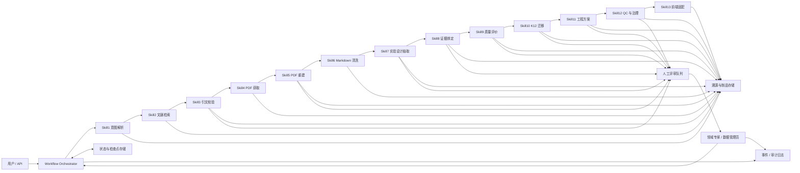
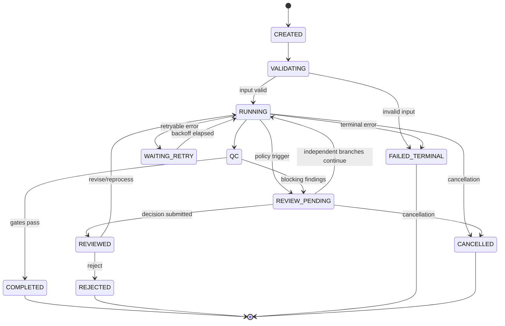

# 论文实验设计抽取模块：框架设计

版本：0.1.0  
状态：Foundation / Skills not implemented

## 1. 目标与边界

本模块把科学论文转换为结构化、证据绑定、可复核、可供 K12 工程迁移分析使用的实验设计知识。

本框架只定义：

- 系统架构与组件边界
- 统一数据模型
- 工作流与状态机
- Skill 接口契约
- 日志、错误、溯源与人工治理
- 测试框架

本阶段不实现 Skill1–Skill13，不把缺失参数补写成推断值，也不把 AI 工程建议混入文献事实。

## 2. 设计原则

1. **证据优先**：重要科学字段必须携带证据定位；无证据时为 `unknown`。
2. **事实与建议隔离**：`literature_experiment` 和 `ai_engineering_proposal` 分区存储。
3. **可恢复执行**：每个 Skill 幂等、可重试、可从检查点恢复。
4. **人机协同**：高风险或冲突项进入评审队列，非依赖分支可继续运行。
5. **追加式审计**：输入、输出、模型/工具版本和人工决定均写入不可变审计事件。
6. **结构化交换**：所有 Skill 使用版本化 JSON 对象交换，禁止以自由文本作为唯一产物。
7. **最小权限与隐私**：原始文献、凭据、个人信息和审计日志分级存储。

## 3. 总体架构



### 3.1 逻辑组件

| 组件 | 职责 | 持久化内容 |
|---|---|---|
| API Gateway | 请求校验、鉴权、限流 | request metadata |
| Orchestrator | DAG 调度、状态迁移、重试、检查点 | workflow run |
| Skill Runtime | 执行统一接口，隔离依赖 | execution record |
| Artifact Store | PDF、Markdown、图表、补充材料 | checksum-addressed artifacts |
| Knowledge Store | 实验设计与评价对象 | versioned JSON |
| Provenance Store | 字段—证据关系 | evidence records |
| Review Service | 队列、认领、决定、升级 | review tasks/decisions |
| Event Store | 追加式业务与审计事件 | structured logs |
| Schema Registry | Schema 与兼容性规则 | schema versions |

### 3.2 存储建议

- 对象存储：PDF、解析产物、图片、表格、补充材料；以 SHA-256 去重。
- 关系数据库：工作流、状态、评审、错误、引用元数据。
- 文档数据库或 JSONB：版本化科学对象。
- 搜索索引：标题、摘要、字段值与证据片段；索引不是事实源。
- 事件存储：追加式日志；敏感字段脱敏，保留期可配置。

## 4. 统一数据模型

权威机器模式见 [unified-schema.json](./unified-schema.json)。

### 4.1 顶层 `PaperExperimentRecord`

| 字段 | 类型 | 说明 |
|---|---|---|
| schema_version | string | 交换模式版本 |
| record_id | UUID | 记录稳定标识 |
| run_id | UUID | 本次工作流标识 |
| research_intent | object | Skill1 产物 |
| literature_candidate | object | Skill2/3 产物 |
| document | object | Skill4–6 文档与制品 |
| literature_experiment | object | Skill7/8 的文献事实 |
| quality_evaluation | object | Skill9 产物 |
| k12_transfer_analysis | object/null | Skill10 产物 |
| ai_engineering_proposal | object/null | Skill11 产物 |
| governance | object | QC 与人工评审状态 |
| provenance | object | 记录级来源与处理链 |
| created_at/updated_at | datetime | UTC 时间 |

### 4.2 证据绑定值 `EvidenceBoundValue`

所有重要实验字段使用同一包装结构：

```json
{
  "value": "30 °C",
  "status": "reported",
  "confidence": 0.97,
  "extraction_method": "table_parser",
  "evidence_ids": ["ev_01"],
  "notes": null
}
```

约束：

- `reported`：必须有 `value` 和至少一个 `evidence_id`。
- `unknown`：`value` 必须为 `null`，不得伪造证据。
- `inferred`：必须有证据、推理说明及明确的 `inference` 标记；不得用于补齐剂量、时间、温度、重复数等关键实验参数。
- 多处冲突不能静默择一，应保留多个候选值并创建冲突对象和评审任务。

### 4.3 证据记录 `EvidenceRecord`

最小定位包含：

- `paper_id`、DOI/PMID 等标识
- `artifact_id`、文件 SHA-256 与版本
- `page`（PDF 页与印刷页可分别记录）
- `section_path`
- `paragraph_id`
- `figure_id` / `table_id` / `supplement_id`
- 原文片段及片段 SHA-256
- 字符偏移或边界框（可用时）
- 抽取器、模型、提示词、代码版本

### 4.4 实验设计字段

`literature_experiment.fields` 至少支持：

`objective`、`hypothesis`、`strain`、`genotype`、`engineering_method`、`experimental_groups`、`controls`、`culture_conditions`、`medium`、`dosage`、`time`、`replicates`、`assay`、`instruments`、`analysis_methods`、`outcomes`。

数组型字段的每个元素单独证据绑定；禁止仅在数组整体挂一个无法区分的证据。

### 4.5 版本与兼容

- 语义化版本：破坏性变更升 major；新增可选字段升 minor。
- 每个对象保存生产它的 `schema_version`。
- Skill 只声明可接受的版本范围。
- 迁移器创建新版本，不覆盖旧记录；旧版本保持可重放。

## 5. Skill 统一接口

### 5.1 调用信封

```json
{
  "context": {
    "run_id": "uuid",
    "step_run_id": "uuid",
    "trace_id": "hex",
    "attempt": 1,
    "requested_by": "user-or-service",
    "deadline": "2026-07-25T08:00:00Z",
    "schema_version": "0.1.0",
    "locale": "zh-CN"
  },
  "input": {},
  "artifact_refs": [],
  "upstream_refs": [],
  "policy": {
    "hallucination_mode": "strict",
    "allow_inference": false,
    "human_review_threshold": 0.7
  }
}
```

### 5.2 返回信封

```json
{
  "status": "succeeded",
  "output": {},
  "artifacts": [],
  "self_check": {
    "passed": true,
    "checks": [],
    "score": 1.0
  },
  "warnings": [],
  "errors": [],
  "metrics": {},
  "provenance": {},
  "review_requests": []
}
```

`status` 取值：`succeeded`、`succeeded_with_warnings`、`needs_review`、`retryable_failure`、`terminal_failure`、`cancelled`。

### 5.3 所有 Skill 的强制契约

每个 Skill 必须：

1. 声明 `skill_id`、语义版本、输入/输出 Schema URI。
2. 先校验输入，再执行；输出在提交前再次校验。
3. 以 `step_run_id + input_hash + skill_version` 提供幂等语义。
4. 输出自检结果和字段级溯源，不只输出最终文本。
5. 把不可得信息写为 `unknown/null`。
6. 产生结构化日志、指标和标准错误码。
7. 不原地修改上游制品；生成带版本的新制品。
8. 支持 dry-run、超时、取消和检查点。
9. 提供正常、缺失、冲突、失败与幻觉防护测试。

### 5.4 Skill 注册表

| ID | 输入 | 输出 | 核心自检 |
|---|---|---|---|
| Skill1 | user request | ResearchIntent | 条件互斥、必填意图、术语规范化 |
| Skill2 | ResearchIntent | LiteratureCandidate[] | 去重、检索式记录、来源覆盖 |
| Skill3 | candidates | ValidatedCitation[] | DOI/题名/作者/期刊/年份一致性 |
| Skill4 | validated citation | DocumentArtifact | 来源、许可、SHA-256、版本 |
| Skill5 | PDF artifacts | StructuredDocument | 页数、章节、图表、参考文献覆盖 |
| Skill6 | structured document | CleanMarkdown | 编号与引用保持、层级合法 |
| Skill7 | clean markdown | LiteratureExperiment | 必填字段存在、未知不补齐 |
| Skill8 | experiment + document | EvidenceBinding | reported 字段证据覆盖率 100% |
| Skill9 | evidence-bound record | QualityEvaluation | 评分范围与缺失项一致 |
| Skill10 | record + K12 context | K12TransferAnalysis | 风险、差异、适用边界完整 |
| Skill11 | facts + constraints | EngineeringProposal | 与文献事实隔离、假设显式 |
| Skill12 | all outputs | GovernanceResult | 规则执行、人审任务与决定可追踪 |
| Skill13 | approved/current record | FrontendViewModel | 默认摘要与 What/Why/How/Evidence/Risk/Alternative |

Skill3 的自动重试上限固定为 3；第三次失败后进入人工评审或终止，不无限重试。

## 6. 工作流与状态机

### 6.1 工作流状态



### 6.2 Step 状态

`PENDING → READY → RUNNING → SUCCEEDED | SUCCEEDED_WITH_WARNINGS | NEEDS_REVIEW | RETRY_WAIT | FAILED | SKIPPED | CANCELLED`

规则：

- 仅依赖该评审结果的下游节点阻塞；其他文献或其他分支继续。
- 每次状态迁移采用乐观锁，并写入 `workflow.state_changed` 事件。
- 重试复用逻辑输入但创建新的 `attempt`，保留前次失败记录。
- 恢复时从最后一个通过 Schema 校验的检查点开始。
- `COMPLETED` 只表示流水线完成，不等于所有内容均经人工确认；前端必须显示治理状态。

### 6.3 质量门

| Gate | 条件 | 失败动作 |
|---|---|---|
| Citation gate | 标识和书目信息可信 | 最多重试 3 次，后评审 |
| Artifact gate | PDF checksum、来源、版本完整 | 重获或终止 |
| Parse gate | 页、章节和关键对象覆盖达阈值 | 降级解析或评审 |
| Evidence gate | 所有 reported 关键字段有证据 | 回退 Skill7/8 |
| Hallucination gate | 不存在无证据 reported 值 | 阻断发布 |
| Separation gate | 文献事实与 AI 建议不混合 | 阻断发布 |
| Governance gate | 阻断型问题已决定 | 等待评审 |

## 7. 日志与可观测性

### 7.1 事件结构

```json
{
  "timestamp": "2026-07-25T08:00:00.000Z",
  "level": "INFO",
  "event_name": "skill.completed",
  "trace_id": "...",
  "run_id": "...",
  "step_run_id": "...",
  "skill_id": "skill8",
  "skill_version": "0.1.0",
  "attempt": 1,
  "actor": {"type": "service", "id": "evidence-binder"},
  "input_hash": "sha256:...",
  "output_hash": "sha256:...",
  "duration_ms": 1532,
  "error_code": null,
  "details": {}
}
```

### 7.2 必须记录

- 请求接收、Schema 校验、Skill 开始/完成/重试/失败
- 状态迁移、制品创建、证据绑定与质量门结果
- 模型、提示词、解析器、代码和数据源版本
- 人工任务创建、认领、评论、决定、撤销与覆盖
- 数据迁移、导出、删除和权限变更

禁止记录访问令牌、完整个人信息和非必要全文。原文证据片段按访问级别存储，日志仅存证据 ID 与哈希。

### 7.3 指标

- 成功率、P50/P95 延迟、重试率、终止失败率
- 每数据源检索命中率、PDF 获取率、解析覆盖率
- reported 字段证据覆盖率、unknown 率、冲突率
- 幻觉门拦截数、人工推翻率、评审等待时间
- 每篇论文成本与模型 token/工具调用量

## 8. 错误处理

完整清单见 [error-codes.md](./error-codes.md)。

### 8.1 分类

- `VAL` 输入/输出校验
- `RET` 文献检索
- `CIT` 引文校验
- `PDF` PDF 获取
- `PAR` 解析与重建
- `CLN` Markdown 清洗
- `EXT` 抽取
- `EVD` 证据绑定
- `QLT` 质量评价
- `TRF` K12 迁移
- `PRP` 工程建议
- `GOV` 治理与评审
- `SYS` 平台、存储、超时和权限

错误对象必须包含 `code`、`category`、`message`、`retryable`、`severity`、`context`、`cause_ref`、`suggested_action`。

### 8.2 策略

- 仅瞬态错误自动重试，使用指数退避和抖动。
- Schema 不合法、许可拒绝、checksum 持续不一致属于终止或人工处理。
- 单篇论文失败不默认终止整批任务。
- 降级路径必须显式产生日志与 warning，不能伪装为成功。
- 任何异常均不得触发用模型“猜测”缺失实验参数。

## 9. 人工评审系统

### 9.1 触发条件

- DOI/题名/作者等书目信息冲突
- 解析覆盖不足、图表或补充材料缺失
- 同一字段存在冲突证据
- 关键 reported 字段证据不足
- 抽取置信度低于策略阈值
- 出现 `inferred` 科学结论
- K12 生物安全、伦理、可操作性风险
- 文献事实与 AI 建议疑似混淆
- 自动 QC 阻断项

### 9.2 ReviewTask

包含：任务 ID、对象/字段路径、触发规则、严重级别、证据对照、机器建议、可选决定、负责人、SLA、依赖节点、创建时间和版本。

允许决定：

- `approve`
- `approve_with_changes`
- `mark_unknown`
- `select_evidence`
- `request_reprocess`
- `reject`
- `escalate`

### 9.3 治理规则

- 评审人不能覆盖原始值；修改创建新版本并保存差异。
- 决定必须包含理由、引用证据、评审人和时间。
- 高风险 K12 建议采用双人复核或领域负责人批准。
- 机器重跑不得覆盖已批准决定；若新证据冲突，创建重新评审任务。
- 前端同时显示 `machine_status`、`review_status`、`publication_status`。

## 10. 测试框架

### 10.1 测试层次

1. Schema 契约测试：每个 Skill 的输入、输出和版本兼容。
2. 单元测试：规范化、哈希、定位、评分、状态迁移、重试判断。
3. Skill 组件测试：使用固定文献夹具，不访问真实外部服务。
4. 工作流集成测试：检查分支、检查点、重试、人审旁路。
5. Golden tests：人工标注字段和证据定位，允许明确的容差。
6. 变形测试：页面重排、页眉变化、同义词变化不应改变事实。
7. 故障注入：超时、限流、损坏 PDF、存储中断。
8. 安全测试：提示注入、恶意 PDF、路径穿越、日志泄密。
9. 回归与性能测试：固定语料集上的质量、成本和延迟趋势。

### 10.2 必测场景

| 场景 | 预期 |
|---|---|
| 正常论文 | 关键字段成功抽取且 reported 均有证据 |
| 信息缺失 | 值为 null、状态 unknown，不补写 |
| 无效 DOI | Skill3 最多 3 次，后评审/失败 |
| 元数据冲突 | 保存冲突候选，不静默选取 |
| 扫描/损坏 PDF | 降级 OCR 或明确解析失败 |
| 表格跨页 | 保留表号、单元格关系和页定位 |
| 正文与补充材料冲突 | 两份证据并存并进入评审 |
| 诱导补全缺失参数 | 幻觉门阻断，保持 unknown |
| AI 建议复述成文献事实 | separation gate 失败 |
| 人审期间批处理 | 无依赖文献继续执行 |
| 重跑相同输入 | 无重复副作用，输出哈希稳定或解释版本差异 |

### 10.3 幻觉测试断言

- `status=reported` ⇒ `value != null && evidence_ids.length > 0`
- `status=unknown` ⇒ `value == null`
- 关键参数不得以 `inferred` 补齐。
- 每个 evidence ID 必须解析到真实制品和有效位置。
- 证据片段必须包含或直接支持该字段；仅语义相似不足以通过。
- 工程方案的每条建议必须带 `proposal` 标签、假设和风险，不能写入 `literature_experiment`。

### 10.4 Golden 数据集

建议按开放许可选取至少：

- 5 篇排版清晰的文本 PDF
- 3 篇扫描 PDF
- 3 篇包含复杂/跨页表格
- 3 篇关键信息缺失
- 3 篇正文与补充材料存在差异
- 2 篇撤稿/更正或版本变化文献

每条人工标注需双人复核，并记录标注指南版本与分歧处理。

### 10.5 发布门槛

- Schema/状态机/错误契约测试 100% 通过
- reported 关键字段证据引用完整率 100%
- 幻觉夹具中缺失关键参数误补率 0%
- 文献事实与 AI 建议混淆率 0%
- Golden 集字段准确率、定位准确率和 unknown 精确率达到产品阈值
- 无未解决的阻断级安全或治理缺陷

## 11. 前端输出约定

默认视图展示：

- 实验目标
- 简明步骤
- 关键条件
- 对照与重复
- 主要结果
- 完整性、证据与评审状态

每个步骤可展开：

`What`、`Why`、`How`、`Evidence`、`Risk`、`Alternative`。

视觉上必须区分：

- 文献明确报告
- 未报告/未知
- 经人工确认
- AI 推断
- AI 工程建议

## 12. 后续 Skill 开发准入清单

开发任一 Skill 前必须提交：

- 版本化输入/输出 Schema
- 依赖和资源预算
- 自检规则与质量阈值
- 错误码映射与重试策略
- 溯源字段映射
- 人审触发规则
- 至少覆盖五类全局必测场景的夹具
- 幂等、取消、超时和检查点测试
- 威胁模型与敏感数据处理说明

只有通过契约测试和幻觉门测试后，Skill 才能注册到生产工作流。
