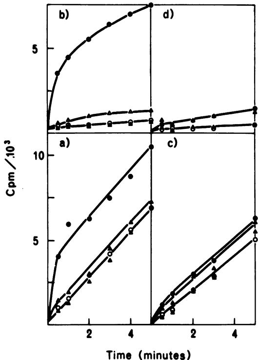
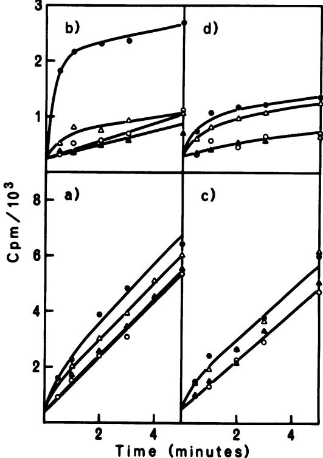
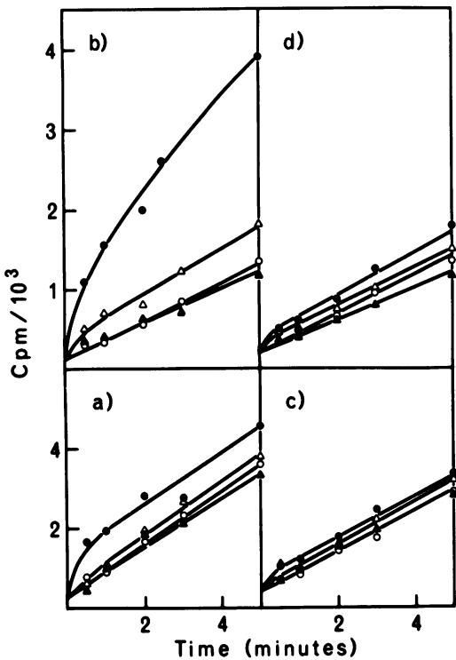
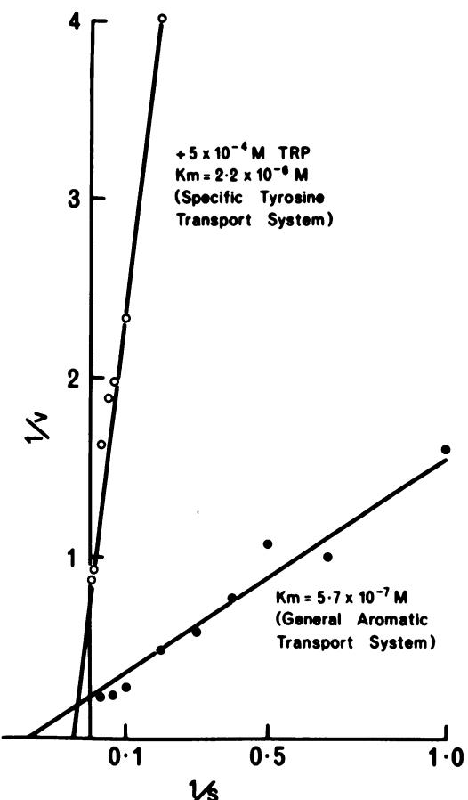
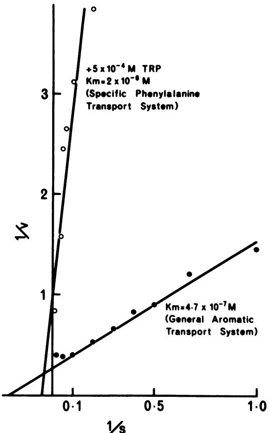
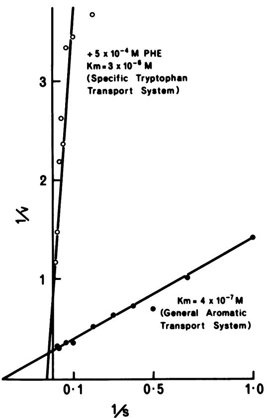
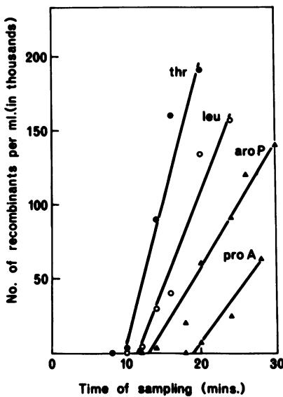
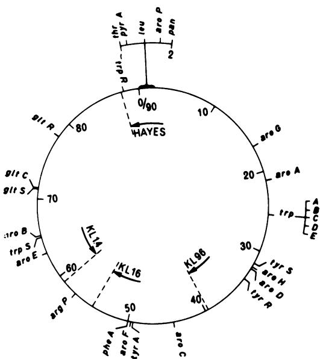

# Formation of Aromatic Amino Acid Pools in Escherichia coli K-12

K. D. BROWN

Research School of Biological Sciences, Australian National University, Canberra, Australia

Received for publication 18 June 1970

Phenylalanine, tyrosine, and tryptophan were taken up into cells of Escherichia coli K-12 by a general aromatic transport system. Apparent Michaelis constants for the three amino acids were $4 . 7 \times 1 0 ^ { - 7 } , 5 . 7 \times 1 0 ^ { - 7 } ,$ and $4 . 0 \times 1 0 ^ { - 7 }$ M, respectively. High concentrations $\mathbf { \left( > 0 . 1 \ m w \right) }$ of histidine, leucine, methionine, alanine, cysteine, and aspartic acid also had an affinity for this system. Mutants lacking the general aromatic transport system were resistant to p-fluorophenylalanine, β-2-thienylalanine, and 5-methyltryptophan. They mapped at a locus, aroP, between leu and pan on the chromosome, being 30% cotransducible with leu and 43% cotransducible with pan. Phenylalanine, tyrosine, and tryptophan were also transported by three specific transport systems. The apparent Michaelis constants of these systems were ${ \bf 2 . 0 ~ \times }$ $1 0 ^ { - 6 } , 2 . 2 \times 1 0 ^ { - 6 } ,$ and $3 . 0 \times 1 0 ^ { - 6 } \mathrm { { M } } ,$ respectively. An external energy source, such as glucose, was not required for activity of either general or specific aromatic transport systems. Azide and 2,4-dinitrophenol, however, inhibited all aromatic transport, indicating that energy production is necessary. Between 80 and 90% of the trichloroacetic acid-soluble pool formed from a particular exogenous aromatic amino acid was generated by the general aromatic transport system. This contribution was abolished when uptake was inhibited by competition by the other aromatic amino acids or by mutation in aroP. Incorporation of the former amino acid into protein was not affected by the reduction in its pool size, indicating that the general aromatic transport system is not essential for the supply of external aromatic amino acids to protein synthesis.

Aromatic amino acid transport in Escherichia coli K-12 and Salmonella typhimurium has recently been investigated (1, 2, 17). In E. coli, it was observed that uptake of phenylalanine, tyrosine, and tryptophan occurred via a single, general aromatic transport system (17). The Michaelis constant of this system for phenylalanine was about $7 \times 1 0 ^ { - 7 } \mathrm { \bf M } .$ In S. typhimurium, on the other hand, four transport systems were described (1). Of these, three were each specific for a single aromatic amino acid. The Michaelis constant for the phenylalanine-specific transport system was measured at about $\bar { 2 } \times 1 0 ^ { - 6 } \textbf { M }$ The fourth transport system, termed the aromatic permease, has many properties similar to the general aromatic transport system described by Piperno and Oxender in E. coli (17). It has a broad specificity, transporting phenylalanine, tyrosine, and tryptophan, with Michaelis constants of the order of 10-7 M. Histidine, too, is transported, but with a higher Michaelis constant $( 1 . 1 \ \mathrm { \times } \ 1 0 ^ { - 4 } \ \mathrm { \textmu } )$ . Mutants lacking the general aromatic permease map close to proA on the S. typhimurium chromosome.

The present paper describes a general aromatic transport system in E. coli K-12, apparently similar to that reported by Piperno and Oxender (17). In addition, three specific aromatic transport systems are present. All four systems appear similar to those described in S. typhimurium (1, 2). The isolation and mapping of mutants defective in the general aromatic transport system are reported.

## MATERIALS AND METHODS

Organisms. The strains of E. coli K-12 used are listed in Table 1. The wild-type strain W1485 was obtained from R. L. Somerville. AB353 and AT2473 were obtained from A. L. Taylor. P118 was obtained from P. Reeves, and Hfr Hayes, KL16, KL96, and KL14, from B. Low. The origin and direction of transfer of Hfr Hayes was described by Hayes (10), and KL16, KL96, and KL14 were described by Low (12, 13; personal communication). KB3100, KB2800, and KB-2880 were isolated in this laboratory. Transducing phage P1kc was obtained from A. J. Pittard.

Media and growth conditions. Cells were grown in medium A of Davis and Mingioli (7) or in L broth of Luria and Burrous (14) with shaking at 37 C on New

TaBLE 1. List of strains
<table><tr><td>Strain</td><td>Genetic locia</td><td>Sex</td></tr><tr><td>W1485 Hfr Hayes KB3100 KB2800 KB2880</td><td> $\mathbf { W i l d _ { \tau } t y p e }$   $t h i ^ { - } , s t r { - } s$   $a r o P ^ { - } , s t r { - } s$   $a r o P ^ { - } , s t r { - } s$   $a r o P ^ { - } , t h i ^ { - } , s t r { - } s$ </td><td>F+ Hfr F⁻ F⁻ Hfr</td></tr><tr><td>P118</td><td> $h i s ^ { - } , ~ t h r ^ { - } , ~ l e u ^ { - } , ~ p r o A ^ { - } , a r g ^ { - } ,$   $t o l A ^ { - } , g a l ^ { - } , a r a ^ { - } , l a c ^ { - } , t h i ^ { - } ,$   $s t r { \cdot } r , \ ( { \lambda } ) ^ { - }$ </td><td> ${ \bf F } ^ { - }$ </td></tr><tr><td>AB353</td><td> $t h r ^ { - } , \ l e u ^ { - } , \ l a c ^ { - } , \ t h i ^ { - } , \ p a n ^ { - } ,$   $s t r { - } r , \ ( { \lambda } ) ^ { - }$ </td><td>Hfr</td></tr><tr><td>AT2473 AT1359</td><td> $p y r A ^ { - } , t h i ^ { - } , ( \lambda ) ^ { - }$   $a r o D ^ { - } , p r o \dot { A } ^ { - } , l a c ^ { - } , g a l ^ { - } , h i s ^ { - } ,$ </td><td>Hfr  $\mathbf { F } ^ { - }$ </td></tr><tr><td>KL96</td><td> $x y l ^ { - } , m t l ^ { - } , a r g ^ { - } , t h i ^ { - } , ( \lambda ) ^ { - }$   $t h i ^ { - } , s t r { - } s$ </td><td></td></tr><tr><td>KL14 KL16</td><td> $t h i ^ { - } , s t r { - } s$   $t h i ^ { - } , s t r { - } s$ </td><td>Hfr Hfr Hfr</td></tr></table>

a Gene symbols: aroP denotes the gene specifying the general aromatic transport system. All other symbols used are those recommended by Taylor and Trotter (22).

Brunswick gyratory shakers. Growth was measured as the increase in absorbancy at 490 nm by use of a 1-cm cuvette and a Shimadzu QV-50 spectrophotometer.

Chemicals. Inorganic chemicals were of analytical reagent grade. Organic chemicals were of the highest grade commercially available. L-Tryptophan-3-uC (23 mCi/mmole), uniformly labeled uC-L-phenylalanine (375 mCi/mmole), and uniformly labeled C-L-tyrosine (379 mCi/mmole) were obtained from New England Nuclear Corp., Boston, Mass. β-2-Thienylalanine, DL-4-methyltryptophan, DL-6-methyltryptophan, DL-p-aminophenylalanine, and DL-p-fluorophenylalanine were obtained from Sigma Chemical Co., St. Louis, Mo. DL-5-Methyltryptophan and L-1- methylhistidine were obtained from Mann Research Laboratories, New York, N.Y. L-Histidinol, S-ethyl-L-cysteine, and L-2-thiolhistidine were obtained from Calbiochem, Los Angeles, Calif. 4-Azaleucine dihydrochloride was obtained from Nutritional Biochemicals Corp., Cleveland, Ohio.

Aromatic amino acid uptake by glucose-starved cells. The procedure of Ames (1) was followed with these modifications: medium A was used in place of medium $\mathbf { \vec { E } \mathcal { C } ; }$ cell suspensions (volume, 100 ml; 2 × 108 cells/ ml) were starved of glucose for 60 min at 37 C and assayed at 37 C instead of 25 C (unless otherwise stated); samples (1 ml) were removed from the assay medium (20 ml) and filtered through membrane filters (Millipore type HA). These were washed with 10 volumes of medium A minus glucose prewarmed to 37 C instead of with cold medium E-C. Filters were dried under an infra-red lamp, placed in vials containing 10 ml of scintillation fluid, and counted in a Beckman LS-250 spectrometer. The scintillation fluid contained, in 1 liter of toluene, 4 g of 2, 5-diphenyloxazole and 0.1 g of 1,4-bis-2-(5-phenyloxazolyl)-benzene. The counting efficiency for C under these conditions was approximately 85% (i.e., 1 mCi corresponds to 1.87 × 10ª counts/min).

Aromatic amino acid uptake by growing cells. Volumes of 20 ml of cells growing exponentially in medium A (cell density, 2 × 108/ml) were added to flasks containing radioactive amino acid and were shaken (200 rev/min) at 37 C on a gyratory water-bath shaker. Samples (1 ml) were withdrawn at the times indicated and filtered through membrane filters. The filters were washed with 10 volumes of medium A minus glucose at 37 C, dried, and counted as described above.

Extraction of trichloroacetic acid-soluble pool. Simultaneously with the sampling of cells for total uptake by one of the above methods, a sample of equal volume was removed into cold trichloroacetic acid (final concentration, 5%, w/v). After about 15 min, the samples were filtered through membrane filters and washed with 20 ml of cold 5% trichloroacetic acid. Filters were then dried and counted as described above. These counts represent the incorporation of radioactive amino acid into protein and transfer ribonucleic acid. The difference between incorporation into whole cells and incorporation into trichloroacetic acidinsoluble material gives the amount of free radioactive amino acid in the cell plus any trichloroacetic acidsoluble, low molecular weight radioactive derivatives thereof. This trichloroacetic acid-soluble fraction is termed the "pool" [after Britten and McClure (4)].

Identification of radioactive material accumulated in the pool. Cells (50 ml of suspension) were incubated with radioactive aromatic amino acid $( 5 \times 1 0 ^ { - 6 } \ \mathbf { M } ,$ 20 mCi/mmole) at 37 C with shaking for 2 min. After filtration (Millipore HA) and washing twice with 25 ml of warm medium A minus glucose, these cells were resuspended and extracted in 10 ml of cold perchloric acid (2%, w/v) for 15 min. The extract was filtered (Millipore HA) and neutralized with KOH; the resulting KClO precipitate was removed by centrifugation, and the supernatant fluid was reduced to dryness by rotary evaporation at 40 C. The dried preparation was dissolved in 0.5 ml of water; unlabeled carrier aromatic amino acid (10-4 M) was added; and then samples (0.1 ml) were chromatographed with radioactive standards (treated in the same way as the extracted amino acids) on 250 μm thick silica gel G thinlayer plates in n-butyl alcohol-acetic acid-water (120: 30:50, v/v; 21). After being sprayed with ninhydrin (0.2%, w/v, acetone), the resulting spots were removed by scraping and were counted in scintillation fluid containing 4% Cab-O-Sil (Packard Instrurent Co., La Grange, Ill.). These counts were compared with the counts obtained by scraping the rest of the chromatogram.

Mapping by conjugation and P1kc transduction. These techniques have been described elsewhere (5).

## RESULTS

Uptake of aromatic amino acids by wild-type $\mathbf { E } _ { \bullet }$ coli K-12 (W1485). The kinetics of transport of C-labeled tyrosine, phenylalanine, and tryptophan by growing W1485 cells are shown in Fig. 1a, 2a, and 3a, respectively. Comparable data for glucose-starved cells are shown in Fig. 1b, 2b, and 3b. Assuming a cell volume of $1 0 ^ { - 1 2 } { \mathsf { c c } } ,$ and based on uptakes by glucose-starved cells at $\mathfrak { s }$ min and an external ¹C-amino acid concentration of 10-º M, the ratios of internal trichloroacetic acidsoluble $\mathbf { \imath } \pmb { \imath } \mathbf { \Lambda } $ -amino acid to initial external $\pmb { 1 4 0 } .$ amino acid are as follows: tyrosine, 350:1 [this gives an internal concentration of 15 μmoles/g (dry weight) of cells (Fig. 1b)]; phenylalanine, 80:1 [internal concentration, 3.5 μmoles $/ \mathbf { g } ,$ dry weight (Fig. 2b)]; and tryptophan, 140:1 [internal concentration, 6 μmoles $/ 8 ,$ dry weight (Fig. 3b)]. When the external amino acid concentration is reduced, these gradients are correspondingly increased. For example, at an initial external concentration of $1 0 ^ { - 8 }$ M, the observed ratios were: tyrosine, 2,800:1; phenylalanine, 800:1; and tryptophan, 1,500:1. The apparent pool sizes, and hence concentration gradients, for growing cells were lower. At an external concentration of $1 0 ^ { - 5 } \mathrm { \ : } \mathrm { m } ,$ they were: tyrosine, 190:1; phenylalanine, $\mathbf { 6 0 : 1 ; }$ and tryptophan, 60:1. The reasons for these lower concentration gradients were not investigated. One factor responsible may be the removal of pool amino acids in protein synthesis; another may be the inhibition of uptake by glucose (see below). Based on uptakes into the trichloroacetic acid-soluble pool of glucose-starved cells at 1 min, the initial transport rates (in micromoles per minute per gram, dry weight) for the general transport system are: tyrosine, 8.5; phenylalanine, 3.1; and tryptophan, 2.1. Corresponding rates for the specific transport systems are: tyrosine, 1.1; phenylalanine, 0.9; and tryptophan, 0.4 μmole per min per g (dry weight) of cells (see Fig. 1b, $^ { 2 \mathbf { b } , }$ and 3b, respectively).

  
FIG. 1. Patterns of 14C-tyrosine $( I O ^ { - 5 } \textbf { \em M } , \textbf { \em 5 }$ mCi/ mmole) uptake per ml of cells at 37 C in: (a) growing W1485, (b) glucose-starved W1485, (c) growing KB3100, (d) glucose-starved KB3100. Uptake into: whole cells $( \bullet ) ,$ trichloroacetic acid-insoluble material $( \odot ) ;$ whole cells in presence of unlabeled tryptophan, $2 \times 1 0 ^ { - 4 }$ M $( \triangle ) ,$ : and trichloroacetic acid-insoluble material in presence of unlabeled tryptophan, $2 \times I O ^ { - 4 }$ M (▲). Under these conditions, an uptake $o f$ 108 counts per min per ml is equivalent to 2.2 μmoles/g (dry weight) of cells.

It is particularly apparent in growing cells (Fig. 1a, 2a, 3a) that uptake into whole cells is bi-

3  
  
FIG. 2. Patterns of C-phenylalanine $( I O ^ { - 5 } \textbf { \em u } , \textbf { \em }$ mCi/mmole) uptake per ml of cells at $_ { 3 7 } c$ in: (a) growing W1485, (b) glucose-starved W1485, (c) growing KB3100, (d) glucose-starved KB3100. Uptake into: whole cells $( \bullet ) ;$ trichloroacetic acid-insoluble material $( \odot ) ;$ whole cells in presence of unlabeled tryptophan, $2 \times 1 0 ^ { - 4 }$ M $( \triangle )$ ; and trichloroacetic acidinsoluble material in presence of unlabeled tryptophan, $2 \times 1 0 ^ { - 4 } \ M \ ( \blacktriangle )$ An uptake of 10ª counts per min per ml is equivalent to 2.2 μmoles/g (dry weight) of cells.

  
FiG. 3. Patterns of $^ { 1 4 } C \cdot$ -tryptophan $( I O ^ { - 5 } \textbf {  { M } } , \textbf {  { S } }$ mCi/mmole) uptake per ml of cells at 37 C in: (a) growing W1485, (b) glucose-starved W1485, (c) growing KB3100, (d) glucose-starved KB3100. $U p \cdot$ take into: whole cells (●); trichloroacetic acidinsoluble material (O); whole cells in presence of unlabeledphenylalanine $2 \times 1 0 ^ { - 4 } \ M \ ( \triangle ) ;$ and trichloroacetic acid-insoluble material in presence of unlabeled phenylalanine, $2 \times I O ^ { - 4 } \ M \ ( \pmb { \Delta } )$ . An uptake of 103 counts per min per ml is equivalent to 2.2 μmoles/g (dry weight) of cells.

phasic. There is a rapid initial uptake, appearing mostly in the trichloroacetic acid-soluble fraction, which lasts for 1 to 2 min, and a slower, linear uptake which is accounted for by incorporation into the trichloroacetic acid-insoluble fraction. Protein synthesis is depressed in glucose-starved cells (Fig. 1b, 2b, 3b) so that the second component of uptake is greatly reduced and a greater proportion of total uptake is trichloroacetic acid-soluble. There is also an absolute increase in labeling of the trichloroacetic acid-soluble pool in glucosestarved cells.

Analysis of the labeled material in the pool showed that after 2 min of incubation of cells with 14C-tyrosine, the label in the pool was $91 \% ^ { 1 4 } \mathrm { C } \cdot$ tyrosine. Comparable values for 14C-phenylalanine and 14C-tryptophan were 84 and 82%, respectively. The other labeled compounds in the pool were not identified

Each aromatic amino acid inhibited transport of the others into the cell. For instance, initial tyrosine uptake was inhibited about 80% by a 20- fold excess of tryptophan (Fig. 1a, b). Phenylalanine and tryptophan uptake was inhibited in an analogous fashion (Fig. 2a, b; 3a, b). Inhibition of uptake was observed from as early as 15 sec (Table 4). The aromatic amino acid pool was not saturated at that time, so the observed inhibition was not caused by competition for a place in the pool but rather was at the level of entry into the pool. Incorporation into protein was not inhibited, so the inhibition of total uptake in growing cells became less apparent as protein synthesis proceeded (Fig. 1a, 2a, 3a). With the low rate of protein synthesis in glucose-starved cells, the inhibition was clearly apparent over the entire time scale (Fig. 1b, 2b, 3b).

These results are interpreted as evidence for a general aromatic transport system which has affinity for all three aromatic amino acids. The mutual inhibitions observed are caused by competition between the aromatic amino acids for uptake by this transport system.

In no case was inhibition complete. In the case of ¹4C-tyrosine uptake, inhibition by a 20-fold excess of unlabeled tryptophan was only about 80% at 30 sec (Fig. 1a, b). 14C-phenylalanine and $\mathfrak { \mathfrak { u } } _ { \mathbf { C } _ { \overline { { \mathbf { \Lambda } } } } }$ tryptophan uptake was inhibited to a similar extent (Fig. 2a, b; 3a, b). These observations suggest the existence of a transport system for each of the aromatic amino acids which is insensitive to inhibition by other aromatic amino acids, i.e., a system specific for one aromatic amino acid alone. Further evidence for such transport systems comes from a consideration of the kinetics of aromatic transport and a study of mutants lacking the general aromatic transport system.

Lineweaver-Burk plots of aromatic amino acid transport gave the following Michaelis constants for the general aromatic transport system: tyrosine, $5 . 7 \times 1 0 ^ { - 7 }$ M (Fig. 4); phenylalanine, $4 . 7 \times$ $\bf { 1 0 ^ { - 7 } }$ M (Fig. 5); tryptophan, $4 . 0 \times 1 0 ? ^ { \prime }$ M (Fig. 6). Measurement of 1C-tyrosine uptake in the presence of a large excess $( 5 \times 1 0 ^ { - 4 } \mathrm { M } )$ of tryptophan $\mathbf { \tau } ( > 1 0 0 { \cdot } \mathbf { f o l d } )$ indicated a fraction of tyrosine uptake resistant to tryptophan. Increase in tryptophan concentration did not further inhibit this fraction of uptake. This fraction of tyrosine transport was termed the tyrosine-specific transport system and had a $K _ { \mathrm { m } }$ of $2 . 2 \times 1 0 ^ { - 6 } \mathrm { ~ M ~ } ( \mathrm { F i g . ~ } 4 )$ Analogous observations were made on 14Cphenylalanine transport, where the phenylalanine-specific transport system had a $K _ { \mathbf { m } }$ of $2 . 0 ~ \times$ $\bf { 1 0 ^ { - 6 } }$ M (Fig. 5). Similarly, the tryptophan-specific transport system (measured as 1C-tryptophan uptake in the presence of $5 \times 1 0 ^ { - 4 }$ M phenylalanine) had a $\pmb { K } _ { \mathbf { m } }$ of $3 . 0 \times 1 0 ^ { - 6 }$ M (Fig. 6).

  
FiG. 4. Lineweaver-Burk plots of 14C-tyrosine $u p \cdot$ take in W1485. Assay procedure: 2-ml volumes of glucose-starved cells were added to flasks containing 14C-amino acid, glucose $( \theta . 2 \% ,$ final concentration), and other additions where indicated. After shaking for 30 sec at ${ } _ { 3 7 } C ,$ the contents of each flask were filtered, washed, and counted as described in Materials and Methods. The counts per minute taken up by whole cells (2 ml) were taken as an approximation to the initial velocity (v) of uptake. Values for 1/v are derived from the expression (1/counts per min) $\times ~ I O ^ { 4 } ;$ (s) is given by the molar concentration of ¹C-tyrosine X 107. Under the assay conditions, an uptake of 104 counts/min is equivalent to 1.1 μmoles of¹C-tyrosine/g (dry weight) of cells. Specific activity was 50 mCi/ mmole. Uptake of 1C-tyrosine (●). This uptake approximates the activity of the general aromatic transport system. No correction has been made for the small contribution made to this curve by the specific tyrosine transport system. Uptake of 1C-tyrosine in the presence of $s \times 1 0 ^ { - 4 }$ M tryptophan (O).

Isolation of mutants defective in the general aromatic transport system. An overnight culture of wild-type E. coli K-12 (W1485) in L-broth was irradiated with ultraviolet light (30 w) for 30 sec at a distance of 30 cm. These cells were then washed twice with medium A, and 0.2-ml samples were plated onto $2 \%$ Difco agar plates containing medium A plus β-2-thienylalanine $( 1 0 ^ { - 4 } \ M )$ . After 48 hr of incubation at $3 7 \dot { \mathbf { C } } ,$ resistant colonies were picked and purified by streaking on L agar plates. After 24 hr of incubation at ${ 3 7 } \mathbf { C } ,$ single colonies were subcultured into medium A and shaken overnight at 37 C. Uptake of aromatic amino acids by these strains was then measured by use of the technique for glucose-starved cells described in Materials and Methods. Of the 50 thienylalanineresistant strains tested, 4 showed reduced aromatic transport. Strains KB2800 and KB3100 were chosen for further study. In addition to their resistance to thienylalanine, both strains are re-

  
FiG. 5. Lineweaver-Burk plots of 1C-phenylalanine uptake in W1485. Assay procedure and method of calculating 1/v are described in Fig. 4. 14C-phenylalanine molar concentration × 10 (s). Uptake of 10⁴ counts/min is equivalent to 1.1 μmoles of¹C-phenylalanine/g (dry weight) of cells. Specific activity was 50 mCi/mmole. Uptake of 14C-phenylalanine (●). This curve represents general aromatic transport activity and is uncorrected for the small contribution made $b y$ the specific phenylalanine transport system. Uptake of C-phenylalanine in presence of $s \stackrel { . } { \times } I O ^ { - 4 }$ M tryptophan (O).

  
FıG. 6. Lineweaver-Burk plots of 14C-tryptophan uptake in W1485. Assay procedure and method of calculating 1/v are described in Fig. 4. 1C-tryptophan molar concentration ×10 (s). Uptake of 10 counts/ min is equivalent to 1.1 μmoles of $^ { 1 4 } C \cdot$ -tryptophan/g (dry weight) of cells. These data are standardized to a specific activity of 50 mCi/mmole (actual specific activity was 23 mCi/mmole). Uptake $o f ^ { 1 4 } C \cdot$ -tryptophan $( \bullet )$ . This curve represents general aromatic transport activity and is uncorrected for the small contribution made by the specific tryptophan transport system. Uptake $o f ^ { 1 4 } C$ -tryptophan in presence of 5 × $\scriptstyle { I O ^ { - 4 } }$ M phenylalanine (O).

sistant to DL-5-methyltryptophan $( 2 \times 1 0 ^ { - 4 } \mathrm { ~ M } )$ and DL-p-fluorophenylalanine $( 2 \times 1 0 ^ { - 4 } \mathrm { \ : M } )$ . The growth rate in medium A was similar to that of W1485 for both mutants, and both subsequently proved to have a similar phenotype and genetic lesion.

To exclude the possibility that these two strains are excretors of aromatic amino acids, their culture supernatants were tested for ability to support the growth of the aromatic auxotroph $\mathbf { A T } \cdot$ 1359 when this mutant was starved of one or all of the aromatic amino acids. No growth support was observed, nor was $\mathbf { 1 4 C } .$ -aromatic amino acid uptake by wild-type W1485 cells reduced when measured in culture supernatants of KB2800 or KB3100. Thus, the reduced uptake of $^ { 1 4 } \mathbf { C }$ -aromatic amino acids seen in KB2800 and KB3100 cannot be attributed to excretion of aromatic amino acids.

The kinetics of transport of labeled tyrosine, phenylalanine, and tryptophan by growing KB-3100 cells are shown in Fig. 1c, 2c, and ${ 3 \mathsf { c } } ,$ respectively. Comparable data for glucose-starved cells are shown in Fig. 1d, 2d, and 3d. The fraction of tyrosine transport sensitive to inhibition by phenylalanine and tryptophan seen in wild-type cells was almost entirely absent (Fig. 1c, d). Tyrosine-specific transport, however, was intact. Phenylalanine and tryptophan transport were similarly affected in KB3100 (Fig. 2c, d; 3c, d). Strain KB2800 resembles KB3100 in its transport properties. These results indicate that these mutants lack the general aromatic transport system. They have been designated $\pmb { a r o P } ^ { - }$ . It is clear from the uptake patterns in growing cells (Fig. 1c, $^ { 2 \mathrm { c } , }$ 3c) that incorporation of external aromatic amino acid into protein is unaffected by the loss of the general aromatic transport system and by the concomitant reduction in pool size. The reduction in pool size noted here also indicates that in this mutant the specific aromatic transport systems cannot fill the large trichloroacetic acid-soluble aromatic pool seen in the wild-type parent.

Mapping of mutants defective in the general aromatic transport system. The $\pmb { a r o P } ^ { - }$ allele of KB-2800 was transduced by use of a P1kc lysate into the male strains Hfr Hayes, KL96, KL14, and KL16. The origins and directions of transfer of these strains are shown in Fig. 8. Selection of $a r o P ^ { - }$ transductants was carried out on agar plates containing minimal medium plus methionine, thiamine (to satisfy the requirement of auxotrophic male strains), and $\beta - 2$ -thienylalanine $( 1 0 ^ { - 4 } \ M )$ . Of the male strains receiving the $\pmb { a r o P } ^ { - }$ allele, only Hfr Hayes $\pmb { a r o P } ^ { - }$ (renamed KB2880) transferred it in crosses with the female P118 interrupted at 30 min. This indicates that $a r o P ^ { - }$ is to the left of the origin of Hfr Hayes, relatively close to it, and some distance to the right of the origin of KL96. Of 79 $\pmb { a r o P } ^ { - }$ recombinants from this cross, $7 7 \%$ were found to be $t h r ^ { + }$ $8 6 \%$ were $l e u ^ { + }$ and 25% $p r o A ^ { + }$ None had received the ${ } h i s ^ { + } ,$ $a r g ^ { + } ,$ or $t h i ^ { + }$ alleles of KB2880. This indicates close linkage of $\pmb { a r o l } ^ { - }$ to $^ { t h r }$ and $\mathbf { \Gamma } _ { l e u . }$ More detailed interrupted matings performed between KB2880 and P118 confirmed this (Fig. 7). The times of entry of markers in the cross shown in Fig. 7 were: $t h r ^ { + }$ , 10 min; $\scriptstyle { l e u ^ { + } }$ , 11.5 min; $a r o P ^ { - }$ 13 min; proA+ 19, min. Thus, aroP- lies between leu and $p r o A .$

A transduction analysis of markers in this region is reported in Table 2. These results indicate that $\pmb { a r o P } ^ { - }$ is cotransduced at a frequency of 30% with $\begin{array} { r } { l e u ^ { + } , } \end{array}$ 43% with pan+, $0 \%$ with $t h r ^ { + } ,$ and 2.1 %with $p y r A ^ { + } .$ This places aroP between leu and pan, well to the right of thr and $p y r A .$ The positions of these markers are shown on the map of the E. coli chromosome in Fig. 8, together with the locations of other genes affecting amino acid transport and the structural and regulatory genes of aromatic amino acid biosynthesis.

  
FıG. 7. Kinetics of zygote formation when the male, KB2880, is mated with the female, ${ \pmb { P } } { \pmb { I } } { \pmb { I } } 8 .$ Samples $o \dot { f }$ the interrupted mating mixture were spread on selective media containing streptomycin (100 ${ \pmb { \mu } } _ { \pmb { \ Z } } / m l )$ The selective medium for aro $P ^ { - }$ recombinants contained β-2-thienylalanine $( I O ^ { - 4 } \textbf { \em M } )$ . This medium allows slow growth of the aro $P ^ { + }$ recipient $P l I 8 ,$ and this is probably sufficient to allow full segregation of aro $\scriptstyle { \pmb { P } } ^ { \bar { - } }$ [which would be expected to be a recessive allele, as is $\pmb { h i s P ^ { - } }$ in S. typhimurium (2)], thus permitting it to be scored as a selective marker.

Requirement of energy for aromatic amino acid transport. Suspensions of glucose-starved W1485 cells failed to concentrate aromatic amino acids at 0 C or at 37 C in the presence of 2, 4-dinitrophenol $( 1 0 ^ { - 3 } \ M )$ or sodium azide $( 1 0 ^ { - 2 } \mathbf { M } ;$ Table 3). Lower concentrations $( 2 . 5 \times 1 0 ^ { - 4 } \mathrm { M } , 5 \times 1 0 ^ { - 4 } \mathrm { M } )$ of $^ { 2 , 4 - }$ dinitrophenol lowered the rate of uptake by about $5 0 \%$ . Both 2,4-dinitrophenol and azide inhibited energy production. These results indicate, therefore, that aromatic uptake is an active process coupled to energy production. An external energy source, such as glucose, is, however, not necessary for aromatic uptake. This is evident from the results with glucose-starved cells shown in Table 4 and in Fig. 1b, 2b, and 3b. This appears to be true ability to inhibit the uptake of 14C-aromatic amino acids into the trichloroacetic acid-soluble pool in glucose-starved W1485 cells. Fifteen amino acid analogues were also tested. Since about $9 0 \%$ of this uptake is via the general aromatic transport system, the inhibition observed was taken as inhibition of this transport system. The results of this survey are reported below and in Table 4. Two concentrations, $1 0 ^ { - 4 }$ and $1 0 ^ { - 3 }$ M (with respect to the L isomer), of each compound were tested. These concentrations were 20- and 200-fold, respectively, the concentration of the 14C-labeled aromatic amino acids.

TABLE 2. Cotransduction of aroP with various markersª
<table><tr><td>Recipient</td><td>Recombinants selected</td><td>Recombinants carrying donor aroP- allele unselected</td></tr><tr><td></td><td></td><td>%</td></tr><tr><td>P118</td><td> $t h r ^ { + } ~ ( 3 9 5 )$ </td><td>0</td></tr><tr><td>P118</td><td> $l e u ^ { + } ~ ( 6 4 6 )$ </td><td>30</td></tr><tr><td>AT2473</td><td> $p y r A ^ { + }$  (415)</td><td>2.1</td></tr><tr><td>AB353</td><td> $p a n ^ { + }$  (166)</td><td>43</td></tr></table>

ª Strain KB3100 was used as the donor. Transducing phage was P1kc. The recipient strains are described in Table 1. The prototrophic transductants were scored for aro $P ^ { - }$ by replication onto plates containing thienylalanine $( 1 0 ^ { - 4 }$ M) plus (DL)-5-methyltryptophan $( 2 \times 1 0 ^ { - 4 } \mathsf { M } )$ . This combination gives a lower background of aroP+ transductants than thienylalanine alone. Numbers in parentheses indicate the number of colonies scored.

  
FIG. 8. Map of $\pmb { E } .$ coli showing the location of aroP and markers linked with it. Other known loci concerned with amino acid transport are: argP, arginine, lysine, and ornithine transport (20, 22); gltC, gltS, gltR, glutamic acid transport (15, 16). HisP, the gene specifying histidine transport, is located on the S. typhimurium chromosome at a position corresponding to min 45 (approximately) on the $\pmb { \cal E } .$ coli chromosome (2). The known structural and regulatory genes of aromatic biosynthesis are also shown. The gene symbols used are those recommended by Taylor and Trotter (22). TyrR, tyrosine regulator gene (23); tyrS, tyrosyltransfer ribonucleic acid synthetase (19).

TABLE 3. Inhibition of aromatic uptake by 2,4-dinitrophenol (DNP), azide, glucose, and low temperatureª
<table><tr><td rowspan=3 colspan=1>Addition or treatment</td><td rowspan=1 colspan=6>Per cent inhibition of</td></tr><tr><td rowspan=1 colspan=2>u4C-tyrosineuptake</td><td rowspan=1 colspan=2>uC-phenyl-alanineuptake</td><td rowspan=1 colspan=2>uC-tryp-tophanuptake</td></tr><tr><td rowspan=1 colspan=1>Geb</td><td rowspan=1 colspan=1>SPpecce</td><td rowspan=1 colspan=1>Gen.</td><td rowspan=1 colspan=1>Sppe.</td><td rowspan=1 colspan=1>Gen.</td><td rowspan=1 colspan=1>Spee.</td></tr><tr><td rowspan=1 colspan=1>DNP $( 2 . 5 \times 1 0 ^ { - 4 } \ \mathsf { M } )$ DNP $( 5 \times 1 0 ^ { - 4 } \ \mathbf { M } )$ DNP $( 1 0 ^ { - 3 } \ M )$  $\bf N a N _ { 3 } \psi ( 1 0 ^ { - 2 } \psi _ { M } )$ Glucose $( 0 . 2 \% )$ Incubation at 0 C... .</td><td rowspan=1 colspan=1>445484962196</td><td rowspan=1 colspan=1>879290</td><td rowspan=1 colspan=1>899518</td><td rowspan=1 colspan=1>8297</td><td rowspan=1 colspan=1>879235</td><td rowspan=1 colspan=1>8085</td></tr></table>

The following 13 amino acids and 4 analogues did not inhibit the general aromatic transport system and, it is concluded, have no affinity for it: arginine, lysine, proline, asparagine, threonine, isoleucine, valine, glutamic acid, glutamine, hydroxyproline, serine, cystine, glycine, α-aminoisobutyric acid, canavanine, homoarginine, and ethionine. In contrast, there was strong, mutual inhibition of uptake by tyrosine, phenylalanine, and tryptophan. Inhibition by the aromatic analogues p-fluorophenylalanine, β-2-thienylalanine, and 5-methyltryptophan parallels the strong inhibition by the natural aromatic amino acids, and it is concluded that these analogues have affinity for the general aromatic transport system. p-Aminophenylalanine, 4-methyltryptophan, and 6-methyltryptophan inhibit less strongly.

Cysteine and its analogue S-ethylcysteine partially inhibited aromatic uptake. Inhibition by histidine, although slight at 10-4 M, was quite significant at $1 0 ^ { - 3 }$ M (30 to 40%). Of its analogues, 1-methylhistidine was a more powerful inhibitor of aromatic uptake than histidine itself, whereas histidinol and thiolhistidine were less inhibitory. Alanine, leucine (and its analogue azaleucine), methionine, and aspartic acid also partially inhibited aromatic uptake. The inhibition caused by these compounds was greater at $_ { 1 0 ^ { - 3 } }$ M than at 10-4 M. Tyrosine uptake was less sensitive to inhibition by alanine, methionine, and aspartic acid than was phenylalanine and tryptophan uptake.

From these results, it is concluded that the general aromatic transport system has high affinity for phenylalanine, tyrosine, tryptophan, and their analogues. It has lower affinity for the neutral amino acids: cysteine, leucine, alanine, and methionine. Histidine at the pH of the assay (pH 7.0) was also predominantly (90%) a neutral amino acid, and it too had an affinity for this transport system in the concentration range $\bf { 1 0 ^ { - 4 } }$ to $1 0 ^ { - 3 }$ M. Aspartic acid, an acidic amino acid, also had a low affinity in this concentration range. The general aromatic transport system, however, lacks affinity for the other acidic and neutral amino acids and the basic amino acids.

TABLE 4. Inhibition of aromatic uptake into the trichloroacetic acid-soluble poolº
<table><tr><td rowspan="2">Additionsb</td><td colspan="3">Per cent inhibition of</td></tr><tr><td>uC-tyrosine uptake</td><td>uC-phenylalanine uptake</td><td>1C-tryptophan uptake</td></tr><tr><td>None. .</td><td>0 (14,620)</td><td>0 (9,792)</td><td>0 (9,129)</td></tr><tr><td>Tryptophan (10-4 m)</td><td>82</td><td>87</td><td>93</td></tr><tr><td>Tryptophan (10-3 m) .</td><td>89</td><td>91</td><td>98</td></tr><tr><td>Phenylalanine (10-4M)</td><td>85</td><td>95</td><td>82</td></tr><tr><td>Phenylalanine (10-8 M)</td><td>94</td><td>98</td><td>88</td></tr><tr><td>Tyrosine (10-4 M).</td><td>94</td><td>82</td><td>81</td></tr><tr><td>Tyrosine (10-8 m) .</td><td>98</td><td>88</td><td>89</td></tr><tr><td>Cysteine (10-4 M)</td><td>15</td><td>16</td><td>0</td></tr><tr><td>Cysteine (10-3 M).</td><td>44</td><td>24</td><td>18</td></tr><tr><td>Histidine (10-4 M).</td><td>15</td><td>16</td><td>17</td></tr><tr><td>Histidine (10-3 M)</td><td>40</td><td>38</td><td>32</td></tr><tr><td>Alanine (10-4 M)</td><td>0</td><td>13</td><td>12</td></tr><tr><td>Alanine (10-8 M).</td><td>10</td><td>18</td><td>17</td></tr><tr><td>Leucine (10-4 m).</td><td>15</td><td>9</td><td>16</td></tr><tr><td>Leucine (10-8 m) .</td><td>29</td><td>31</td><td>29</td></tr><tr><td>Methionine (10-4M).</td><td>4</td><td>18</td><td>21</td></tr><tr><td>Methionine (10-3 M).</td><td>19</td><td>24</td><td>26</td></tr><tr><td>Aspartic acid (10-4M)</td><td>0</td><td>13</td><td>11</td></tr><tr><td>Aspartic acid (10-8M)</td><td>0</td><td>19</td><td>15</td></tr><tr><td>(DL) PFP (2 × 10−4M)</td><td>88</td><td>94</td><td>85</td></tr><tr><td>(DL) PFP (2 × 10−3 M)</td><td>96</td><td>97</td><td>89</td></tr><tr><td>TA (10-4 )...</td><td>73</td><td>82</td><td>71</td></tr><tr><td>TA (10-° M).</td><td>89</td><td>94</td><td>86</td></tr><tr><td>(DL) PAP (2 × 10−4 M).</td><td>66</td><td>72</td><td>57</td></tr><tr><td>(DL) PAP (2 × 10-3M)</td><td>86</td><td>88</td><td>87</td></tr><tr><td>(DL) 4MT (2 × 10-4)</td><td>68</td><td>68</td><td>58</td></tr><tr><td>(DL) 4MT (2 × 10-8 M).</td><td>83</td><td>89</td><td>83</td></tr><tr><td>(DL) 5MT (2 × 10−4 m).</td><td>76</td><td>82</td><td>74</td></tr><tr><td>(DL) 5MT (2 × 10-3 M)</td><td>87</td><td>91</td><td>88</td></tr><tr><td>(DL) 6MT (2 × 10−4 ).</td><td>53</td><td>46</td><td>34</td></tr><tr><td>(DL) 6MT (2 × 10−3 M).</td><td>82</td><td>86</td><td>85</td></tr><tr><td>È-Cys (10-4 m) ..</td><td>3</td><td>24</td><td>10</td></tr><tr><td>E-Cys (10-3 M).</td><td>40</td><td>43</td><td>29</td></tr><tr><td>Me-His (10-4m)</td><td>20</td><td>29</td><td>10</td></tr><tr><td>Me-His (10-3 m).</td><td>59</td><td>60</td><td>33</td></tr><tr><td>Hol (10-4m).</td><td>3</td><td>15</td><td>2</td></tr><tr><td>Hol (108m) .</td><td>2</td><td>26</td><td>0</td></tr><tr><td>T-His (10-4M)</td><td>0</td><td>20</td><td>0</td></tr><tr><td>T-His (10-° m).</td><td>9</td><td>20</td><td></td></tr><tr><td>A-Leu (10-4M).</td><td>10</td><td>25</td><td>257</td></tr><tr><td>A-Leu (10-° M).</td><td>13</td><td>33</td><td></td></tr></table>

ªUptake was performed in glucose-starved cells, and trichloroacetic acid-soluble pools were calculated, as described in Materials and Methods. Volume sampled was 2 ml, assay temperature was 37 C, and incubation time was 15 sec. 14C-amino acid concentration was $5 \times 1 0 ^ { - 6 }$ M, 10 mCi/mmole. Unless otherwise indicated, all amino acids were the L isomers. Numbers in parentheses indicate counts per minute taken up by the uninhibited control.  
Abbreviations for the natural amino acids follow I.U.B. rules; PFP, p-fluorophenylalanine; TA, β-2-thienylalanine; PAP, p-aminophenylalanine; MT, methyltryptophan; E-cys, S-ethylcysteine; Me-His, 1-methyl-histidine; Hol, histidinol; T-His, 2-thiolhistidine; A-Leu, 4-azaleucine.

Inhibition of the specific aromatic transport systems. Of the 22 natural amino acids tested, only phenylalanine (at 10-3 M) inhibited tyrosine uptake into the trichloroacetic acid-soluble pool via the tyrosine-specific transport system (Table 5). Conversely, tyrosine $( 1 0 ^ { - 3 } \mathbf { \mu } _ { \mathbf { M } } )$ inhibited the phenylalanine-specific transport system. Tryptophan $( 1 0 ^ { - 3 } \mathbf { M } )$ did not significantly inhibit either of these transport systems (the slight inhibition seen was probably due to inhibition of residual general aromatic transport), nor was tryptophan-specific transport significantly inhibited by phenylalanine or tyrosine. Apart from serine, which partially inhibited both the phenylalanine- and tryptophanspecific transport systems, no other natural amino acid inhibited the specific aromatic transport systems.

TABLE 5. Inhibition of aromatic uptake into the trichloroacetic acid-soluble pool via the specific aromatic transport systemsª
<table><tr><td rowspan="2">Additionsb</td><td colspan="3">Per cent inhibition of</td></tr><tr><td>Specific 4C-tyrosine uptakec</td><td>Specific C-phenyl- alanine uptake</td><td>Specific - tryptophan uptakec</td></tr><tr><td>None . .</td><td>0 (2,228)</td><td>0 (956)</td><td>0 (508)</td></tr><tr><td>Tryptophan (10-4 M)</td><td>0</td><td>0</td><td></td></tr><tr><td>Tryptophan (10-3 m).</td><td>26</td><td>25</td><td>&gt;90</td></tr><tr><td>Phenylalanine (10-4M)</td><td>20</td><td>&gt;90</td><td>12</td></tr><tr><td>Phenylalanine (10-3M).</td><td>51</td><td>&gt;90</td><td>20</td></tr><tr><td>Tyrosine (10-4 M).</td><td>&gt;90</td><td>19</td><td>0</td></tr><tr><td>Tyrosine (10-3 m)</td><td>&gt;90</td><td>70</td><td>0</td></tr><tr><td>Serine (10-4 M)..</td><td>0</td><td>24</td><td>0</td></tr><tr><td>Serine (10-3 M).</td><td>0</td><td>29</td><td>54</td></tr><tr><td>(DL) PFP (2 × 10-4M)</td><td>37</td><td>59</td><td>0</td></tr><tr><td>(DL) PFP (2 × 10−3 M) .</td><td>92</td><td>82</td><td>0</td></tr><tr><td>TA (10−4 M)...</td><td>15</td><td>65</td><td>35</td></tr><tr><td>TA (10−3 M) . .</td><td>60</td><td>92</td><td>68</td></tr><tr><td>(DL) PAP (2 × 10-4M).</td><td>6</td><td>8</td><td>0</td></tr><tr><td>(DL) PAP (2 × 10-3M)</td><td>11</td><td>18</td><td>13</td></tr><tr><td>(DL) 4MT (2 × 10−4 ).</td><td>0</td><td>0</td><td>70</td></tr><tr><td>(DL) 4MT (2 × 10−3 M).</td><td>31</td><td>20</td><td>82</td></tr><tr><td>(DL) 5MT (2 × 10−4 M).</td><td>0</td><td>0</td><td>24</td></tr><tr><td>(DL) 5MT (2 × 10-3 M).</td><td>37</td><td>35</td><td>30</td></tr><tr><td>(DL) 6MT (2 × 10−4 M).</td><td>0</td><td>0</td><td>18</td></tr><tr><td>(DL) 6MT (2 × 10-3M).</td><td>24</td><td>24</td><td>32</td></tr><tr><td>È-Cys (10-4 m).</td><td>0</td><td>15</td><td>52</td></tr><tr><td>E-Cys (10-3 m).</td><td>0</td><td>47</td><td>67</td></tr></table>

ª Assays were performed as described in Table 4.  
bAbbreviations: see Table 4.  
Specific aromatic transport activity was taken as ¹4C-amino acid uptake in the presence of a 20-fold excess (10-4 M) of unlabeled inhibiting aromatic amino acid (tryptophan in the case of 14C-tyrosine and 14C-phenylalanine uptake, and phenylalanine in the case of 1C-tryptophan uptake).

Of the 15 analogues tested, the following did not inhibit any of the specific aromatic transport systems: α-aminoisobutyric acid, azaleucine, canavanine, homoarginine, ethionine, 1-methylhistidine, histidinol, and thiolhistidine. The tyrosine-specific transport system was strongly inhibited by p-fluorophenylalanine. Thienylalanine and 4-, 5-, and 6-methyltryptophan were less inhibitory, and p-aminophenylalanine and S-ethylcysteine failed to inhibit tyrosine-specific uptake at all. The phenylalanine-specific transport system showed a similar sensitivity to aromatic analogues. It was slightly more sensitive to thienylalanine inhibition, however, and was partially inhibited by S-ethylcysteine (10-3 M). The tryptophan-specific transport system showed a somewhat different pattern of analogue inhibition. p-

Fluorophenylalanine was not an inhibitor, and thienylalanine and p-aminophenylalanine inhibited only slightly. 4-Methyltryptophan was a good inhibitor, but 5- and 6-methyltryptophan were less effective. S-ethylcysteine partially inhibited the tryptophan-specific transport system. Because of the relatively small pool generated by the tryptophan-specific transport system, the inhibitions shown here are only approximate values. None of the analogues tested specifically inhibited a single specific aromatic transport system.

It is concluded from these results that the specific aromatic transport systems transport one natural amino acid only at concentrations up to 10-4M. At 10-3 M, however, phenylalanine had an affinity for the tyrosine-specific transport system in addition to its own specific transport system, and vice versa.

## DISCUSSION

The existence of a general transport system for the aromatic amino acids in E. coli K-12 has been demonstrated. In addition, each aromatic amino acid is transported by its own specific transport system. Earlier work by DeMoss and co-workers $( 3 , 6 )$ demonstrated yet another transport system which transports high concentrations of tryptophan $( K _ { \mathrm { m } } , \bar { 7 } \times 1 0 ^ { - 5 } \mathrm { \ : m } )$ . This transport system is induced by tryptophan in the presence of Casamino Acids and is repressed by glucose. It is absent under the growth conditions used in the present work, although it has been observed in strains W1485 and KB3100 $\left( a r o P ^ { - } \right)$ grown under inducing conditions (Brown, unpublished data).

The reasons for the multiplicity of aromatic transport systems are unknown. Incorporation of external aromatic amino acid into protein is uninterrupted when the general aromatic transport system is blocked by inhibition or mutation (Fig. 1–3). It seems clear, therefore, that, although this transport system supplies the bulk of aromatic amino acids to the trichloroacetic acid-soluble pool in wild-type cells grown in minimal medium, it is not essential for the supply of external aromatic amino acids to protein synthesis. This suggests that the primary role of the general aromatic transport system is not the generation of a pool for protein synthesis. This function would be more efficiently performed by the specific aromatic transport systems in which the uptake of a particular exogenous aromatic acid cannot be blocked by other amino acids. It is most probable, however, that amino acids transported by the general aromatic transport system are available for protein synthesis. This has been demonstrated in S. typhimurium, where the general aromatic transport system provides histidine for growth in a strain blocked in both histidine biosynthesis and histidine-specific transport (2). It is possible that the general aromatic transport systems' role is secondary, scavenging aromatic amino acids present in low concentrations in the medium or supplying amino acids for catabolism or for regulation. A regulatory role in aromatic biosynthesis seems rather unlikely in view of the non-specific nature of the general aromatic transport system and the high specificity of feedback inhibition and repression of aromatic biosynthesis (for review, see 9).The significance of the relatively low affinities displayed by the general aromatic transport system towards cysteine, histidine, leucine, alanine, methionine, and aspartic acid is unknown. Most of these amino acids have previously been shown to be transported by other transport systems which have much higher affinities for them (1, 17).

The relatively high $K _ { \mathrm { m } } ~ ( 7 ~ \times ~ 1 0 ^ { - 5 } ~ \mathrm { M } )$ of the inducible tryptophan transport system $( 3 , ~ 6 )$ suggests a role for this transport system, unrelated to regulation of tryptophan biosynthesis [which occurs at exogenous tryptophan concentrations more than 10 times lower than the $\pmb { K } _ { \mathbf { m } }$ for this transport system (C. H. Doy, personal communication; Brown, unpublished data)] or protein synthesis. It is more probable that it provides tryptophan for catabolism, a function useful when relatively high concentrations of tryptophan are encountered in the medium in the absence of glucose.

The observation in both E. coli (Fig. 1-3) and S. typhimurium (1) that the general aromatic transport system does not require an exogenous energy source (such as glucose) for activity contrasts with the finding of Britten and McClure (4) that an exogenous energy source is required for the transport of proline and other amino acids in E. coli. This discrepancy is explained by the longer glucose-starvation period employed by Britten and McClure (several hours). If this period is reduced to 90 min, proline transport, like aromatic transport, needs no exogenous energy supply, and the addition of glucose does not stimulate transport (Brown, unpublished data). It is concluded that the energy required for active transport of amino acids under the latter conditions is derived endogenously either from catabolism or from unexpended adenosine triphosphate. A catabolic source is more likely, because azide and 2,4-dinitrophenol, which inhibit energy production, inhibit aromatic transport also (Table 3). A similar observation has been made by De-Busk and DeBusk on phenylalanine transport in Neurospora crassa (8). These authors found that phenylalanine transport required no exogenous supply of energy. Kay and Gronlund also found that in Pseudomonas aeruginosa the rates of transport of most of the amino acids remained unchanged after 90 min of carbon deprivation (11). They attributed this to the high rate of catabolism in this organism.

The close linkage of the aroP gene to leu and pan in E. coli K-12 differs from the location of aroP reported by Ames and Roth in S. typhimurium (2). These authors reported linkage of aroP to proA. Several markers in this region in S. typhimurium, including proA, pan, and leu, failed to cotransduce with aroP. No gene was found which did cotransduce with it. This difference in location suggests either that aroP, unlike most other genes (18), is located in $\pmb { E } .$ coli at a position different from that in S. typhimurium, or that the $\pmb { a r o P } ^ { - }$ alleles mapped in the two organisms, are, in fact, alleles of two different genes, both of which affect the general aromatic transport system. The latter possibility cannot be excluded yet, particularly as the $\pmb { a r o P } ^ { - }$ mutants of

E. coli were isolated on the basis of resistance to β-2-thienylalanine whereas those of S. typhimurium were isolated by use of azaserine. These two analogues could conceivably affect different macromolecular elements of the general aromatic transport system.

In neither E. coli nor S. typhimurium is aroP closely linked to any of the known loci affecting amino acid transport or to any of the known structural or regulatory genes of aromatic amino acid biosynthesis (Fig. 8). The genes for the specific aromatic transport systems and the inducible tryptophan transport system remain to be mapped.

## ACKNOWLEDGMENT

I thank Audrey McGeagh for excellent technical assistance in this work.

## LITERATURE CITED

1. Ames, G. F. 1964. Uptake of amino acids by Salmonella typhimurium. Arch. Biochem. Biophys. 104:1-18.

2. Ames, G. F., and J. R. Roth. 1968. Histidine and aromatic permeases of Salmonella typhimurium. J. Bacteriol. 9:1742- 1749.

3. Boezi, J. A., and R. D. DeMoss. 1961. Properties of a tryptophan transport system in Escherichia coli. Biochim. Biophys. Acta 49:471-484.

4. Britten, R. J., and F. T. McClure. 1962. The amino acid pool in Escherichia coli. Bacteriol. Rev. 26:292–335.

5. Brown, K. D. 1968. Regulation of aromatic amino acid biosynthesis in Escherichia coli K-12. Genetics 60:31-48.

6. Burrous, S. E., and R. D. DeMoss. 1963. Studies on tryptophan permease in Escherichia coli. Biochim. Biophys. Acta 73:623-637.

7. Davis, B. D., and E. S. Mingioli. 1950. Mutants of Escherichia coli requiring methionine or vitamin B1. J. Bacteriol. 60:17-28.

8. DeBusk, B. G., and A. G. DeBusk. 1965. Molecular trans-

port in Neurospora crassa. I. Biochemical properties of a phenylalanine permease. Biochim. Biophys. Acta 104:139- 150.

9. Gibson, F., and J. Pittard. 1968. Pathways of biosynthesis of aromatic amino acids and vitamins and their control in microorganisms. Bacteriol. Rev. 32:465–492.

10. Hayes, W. 1953. The mechanism of recombination in Escherichia coli. Cold Spring Harbor Symp. Quant. Biol. 18:75– 93.

11. Kay, W. W., and A. F. Gronlund. 1969. Influence of carbon or nitrogen starvation on amino acid transport in Pseudomonas aeruginosa. J. Bacteriol. 100:276–282.

12. Low, B. 1965. Low recombination frequency for markers very near the origin in conjugation in E. coli. Genet. Res. 6:469-473.

13. Low, B. 1968. Formation of' merodiploids in matings with a class of rec- recipient strains of Escherichia coli K-12. Proc. Nat. Acad. Sci. U.S.A. 60:160–167.

14. Luria, S. E., and J. W. Burrous. 1957. Hybridization between Escherichia coli and Shigella. J. Bacteriol. 74:461–476.

15. Marcus, M., and Y. S. Halpern. 1967. Genetic analysis of glutamate transport and glutamate decarboxylase in Escherichia coli. J. Bacteriol. 93:1409–1415.

16. Marcus, M., and Y. S. Halpern. 1969. Genetic analysis of the glutamate permease in Escherichia coli K-12. J. Bacteriol. 97:1118–1128.

17. Piperno, J. R., and D. L. Oxender. 1968. Amino acid transport systems in Escherichia coli K-12. J. Biol. Chem. 243: 5914-5920.

18. Sanderson, K. E. 1967. Revised linkage map of Salmonella typhimurium. Bacteriol. Rev. 31:354–372.

19. Schlesinger, S., and E. W. Nester. 1969. Mutants of Escherichia coli with an altered tyrosyl-transfer ribonucleic acid synthetase. J. Bacteriol. 100:167–175.

20. Schwartz, J. H., W. K. Maas, and E. J. Simon. 1959. An impaired concentrating mechanism for amino acids in mutants of Escherichia coli resistant to L-canavanine and D-serine. Biochim. Biophys. Acta 32:582-583.

21. Smith, I. 1958. Chromatographic and electrophoretic techniques, vol. 1, Chromatography. Heinemann, London.

22. Taylor, A. L., and C. D. Trotter. 1967. Revised linkage map of Escherichia coli. Bacteriol. Rev. 31:332–353.

23. Wallace, B. J., and J. Pittard. 1969. Regulator gene controlling enzymes concerned in tyrosine biosynthesis in Escherichia coli. J. Bacteriol. 97:1234-1241.