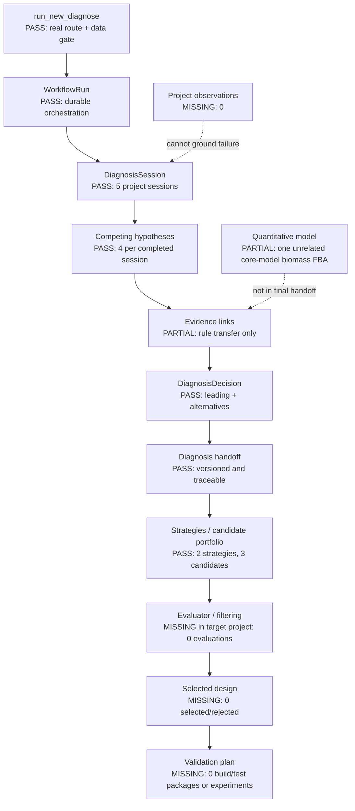

# Diagnosis → Engineering Design Scientific Acceptance Audit

审计日期：2026-08-12  
目标项目：`PROJ-3f77f638302b`  
审计性质：只读；未修改代码、未补数据、未触发 evaluator 或实验流程。

## Executive finding

**PARTIAL**

平台已经超出简单的 “Hypothesis + Evidence + Design Handoff”：存在问题地图 UI、竞争假设、证据分级、诊断版本化 handoff、诊断驱动策略/候选生成、完整 evaluator 逻辑、Pareto 决策和 Build/Test Planner。

但目标项目的真实链路停在 `portfolio_generated`。没有项目 Observation，没有与最终 handoff 对齐的定量模型结果，没有 DesignEvaluation，没有候选淘汰/选择，也没有 ValidationPlan 或实验计划。因此当前真实结果仍是：

`rule-grounded hypotheses → diagnosis decision → proposed design portfolio`

而不是已完成的：

`observed failure → quantitatively grounded causal problem map → evaluated/selected intervention → executable validation plan`

## A. 当前真实架构图

## 1. Repository Truth Audit

### Frontend

- `RunNewDiagnosisPage`：配置 scientific objective、项目上下文、六项 data sufficiency、scope、evidence/model inventory；调用真实 orchestrator；支持 durable run 恢复。
- `DiagnosisWorkbenchPage`：消费 session、hypotheses、evidence、decision、tests、capabilities；显示 leading/alternative、evidence for/against、coverage、quantitative missing state、engineering consequence。
- `DiagnosisSessionDetailPage`：提供更细的状态、证据、模型、测试、决策和审计记录操作面。
- `DesignWorkbenchPage`：消费 handoff、strategies、candidates、latest evaluations；显示 diagnosis trace、候选比较、rejected/excluded、selected stack 和 validation 空态。
- `DesignProjectDetailPage`：提供 objective、strategy、portfolio、evaluation、build/test、governance 的操作入口。
- Evidence/Provenance 页面和组件存在，但目标项目 diagnosis evidence 为 DDR expert-rule links，没有论文或实验 provenance 可展开。

### Backend

- Diagnosis：Session、HypothesisAssessment、EvidenceItem/Link、ModelRun、DiagnosticTest、Decision 均有 Schema、logic 和 API。
- Design：DiagnosisHandoff、Strategy、Candidate、Portfolio、Evaluation、CounterfactualRun、BuildTestPackage、HumanApproval、Outcome 均有 Schema。
- Evaluator：Mechanism、Evidence、Counterfactual、Tradeoff、Buildability、Validation、Safety/Governance、Diversity、Confidence 共 9 个 evaluator；有 hard constraint、blocking finding、Pareto 和 recommendation logic。
- Validation：BuildTestPackage planner 会要求 construction、materials、controls、replicates、sampling、QC、decision rules；不会自动虚构这些输入。

### 验证证据

- Diagnosis + Engineering Design 测试：**152 passed**，3 个依赖弃用 warning。
- 目标项目相关只读 API 全部返回 HTTP 200。
- `GET /projects/EDP-78ae7989000f/evaluations` 返回空集合，符合数据库中的 0 evaluations。

## 2. Diagnosis：是否达到 Engineering Problem Map

| Required link | Project evidence | Verdict |
|---|---|---|
| Observation | `observations=0`；session baseline observation IDs 为空 | MISSING |
| Mechanism | 4 个机制假设：aromatic pathway、PEP/E4P、central flux、measurement artifact | PASS（作为假设） |
| Evidence | 3 条支持 link/会话，均为 DDR-001 expert rule | PARTIAL |
| Confidence | hypothesis confidence=low；assessment weakly_supported/untested；decision overall=medium | PARTIAL，且 decision medium 与底层 low evidence 需要更强解释 |
| Engineering consequence | leading hypotheses 进入 Design；precursor hypothesis 生成 ptsG/non-PTS 方向候选 | PASS |
| Validation need | falsifiers、discriminating predictions 存在 | PARTIAL；没有 DiagnosticTest 或项目计划 |

结论：UI 已形成 Problem Map 的阅读结构，但目标项目没有 Observation 层，不能称为被项目数据接地的完整 Engineering Problem Map。它是一个**规则驱动、证据有限的竞争假设地图**。

### Hypothesis competition

- leading：2 个。
- alternatives not excluded：2 个。
- evidence for：12 个项目级 links，分布于 4 个完成会话。
- evidence against：0。
- contradictions：0。
- falsifier：每个假设都有结构化 falsifier。
- discriminating tests：0 个持久化测试。

竞争集合和反证语义存在，实际判别证据尚不存在。

## 3. Evidence 审查

### 语义区分能力

前端/后端能够区分或表达：

- `MEASURED`：Schema/映射存在；项目没有。
- `LITERATURE_REPORTED`：Schema/映射存在；项目没有。
- `DATABASE_FACT`：前端 fallback 类别存在；项目诊断没有相应事实记录。
- `MODEL_COMPUTED`：Schema/映射存在；项目有单独 model run，但未链接到最终 handoff evidence。
- `MODEL_PREDICTED`：未形成清晰独立的一等 evidence label；counterfactual model result 可表达预测，但项目没有。
- `RULE_TRANSFER`：项目真实存在，12 条，全部 low/indirect。
- `MECHANISTIC_INFERENCE`：Workbench 明确标注 hypothesis finding 为推断。
- `HYPOTHESIS`：由 HypothesisVersion/Assessment 表达，不与 evidence item 混为一体。

### 项目证据质量

- source type：100% `expert_rule`。
- source reference：DDR-001。
- quality：100% low。
- directness：100% indirect。
- condition match：unknown。
- supports：12；contradicts：0。
- observation/model/experiment foreign keys：均为空。

**结论：PARTIAL。** Provenance 结构和 UI 校准存在，但项目没有硬证据。Rule transfer 不得解释为实验确认或 causal truth。

## 4. Quantitative Grounding

项目中检测到 1 个真实 `gem_fba` run：

- session：`DIAG-1e9f307d7ac3`，不是最终 Design 引用的 `DIAG-d23cfa28206e`。
- model：bundled `e_coli_core`。
- objective：biomass objective value `0.8739`。
- 有 top flux distribution 和 named exchange fluxes。
- 没有 L-tryptophan production reaction/objective。
- 没有 yield、FVA、growth-vs-production tradeoff、candidate counterfactual 或 omics constraints。
- `model_assessment_reference` 为空；Design candidate model/counterfactual results 为 0。

**Capability missing at accepted project chain: Quantitative grounding.**

**Impact: Diagnosis remains qualitative.** 该 FBA 只能证明 adapter 可运行，不能支持“PEP/E4P 是此项目瓶颈”或“ptsG knockout 会提高 L-tryptophan”的项目级定量结论。

## 5. Engineering Design 审查

### Diagnosis 驱动性

Design `EDP-78ae7989000f` 明确记录：

- diagnosis session：`DIAG-d23cfa28206e`。
- diagnosis decision：`DDEC-837ba7a58427`。
- diagnosis version：1。
- handoff：supported hypotheses、unresolved alternatives、confidence、uncertainty、evidence references。
- strategy `precursor_supply` 指向 PEP/E4P hypothesis。
- low-risk candidate 的 top-level evidence links 指回 source hypothesis，并附 ACT/DDR/RULE precedent。
- information-gain candidate 指向两个 unresolved alternatives。

因此 Design 确实知道方案来自哪个诊断，且不是纯文本 summary handoff。

### Candidate completeness

| Candidate | Diagnosis origin | Rationale/evidence | Risk/trade-off | Validation strategy |
|---|---|---|---|---|
| Reference/control | diagnosis version only | baseline rationale | none recorded | no package |
| ptsG/non-PTS precursor candidate | PEP/E4P hypothesis ID | causal chain + ACT/DDR/RULE | tradeoff profile not assessed | no package |
| information-gain probe | 2 alternative hypothesis IDs | discrimination rationale | unresolved target `to_be_determined` | no diagnostic test/package |

候选生成通过，但所有 candidate 均为 conceptual/proposed。没有 evaluation-derived risk、buildability 或 validation plan。

### Alternatives and rejected candidates

- Portfolio 有 3 个角色：reference/control、low-risk、information-gain。
- 明确记录 high-upside、process-first、fallback 缺席原因。
- 记录 feedback、competition、cofactor、burden、dynamic regulation、transport/tolerance、process 等策略未生成原因。
- 候选级 rejected：0。

这里存在**生成时排除理由**，但不存在**Evaluator 后淘汰结果**。

## 6. Evaluator 审查

### 平台实现等级

逻辑层具备：Generate → Evaluate → hard-filter → Pareto → recommend selected set。按代码能力可接近 **Level 3**。

Hard checks 包括：

- missing evidence / dangling strategy linkage；
- hard constraints；
- essential-gene knockout；
- unresolved build target；
- validation package absence；
- safety/governance；
- duplicate/diversity；
- model/counterfactual absence。

Soft dimensions包括：

- primary objective vector（没有模型时 magnitude=`not_computed`）；
- evidence strength；
- build complexity；
- qualitative growth burden；
- information gain；
- Pareto status；
- explicit preference ranking。

### 目标项目实际等级

`design_evaluations=0`，portfolio decision=null，candidate statuses 全为 proposed。

因此目标项目实际表现为 **Level 0（未运行）**，不是 Level 3。不能因为 evaluator Schema、代码或测试存在，就宣称项目已完成筛选。

## 7. Diagnosis → Design 数据契约

要求的理想链：

`DiagnosisFinding.id → CandidateIntervention.diagnosis_ids → EvaluationResult → SelectedDesign → ValidationPlan`

当前实际链：

`HypothesisVersion.id / DiagnosisDecision.id → DiagnosisHandoffRecord → EngineeringStrategy.evidence_links / CandidateDesign.evidence_links → DesignEvaluation(optional) → CandidateDesign.status(optional) → BuildTestPackage(optional)`

判定：**PARTIAL**。

- 优点：诊断 session/decision/version 和 hypothesis IDs 可追溯；未排除替代机制不会被 handoff 擦除。
- 缺点：没有独立 `DiagnosisFinding` 实体，也没有强类型 `candidate.diagnosis_ids`；映射藏在 heterogeneous JSON evidence links 中。Evaluation、SelectedDesign、ValidationPlan 在目标项目均为空。

## 8. 真实项目端到端追踪

### Input

- host：Escherichia coli K-12。
- product：L-tryptophan。
- project objectives：空数组；Design 后续记录 primary metric=titer, unit=g/L。
- baseline/condition/time/QC/phenotype observations：无持久化 Observation。

### Diagnosis

- 5 sessions；4 个已 handoff，1 个因真实 data gate 停在 `data_required/insufficient`。
- 采用的 Design source session：`DIAG-d23cfa28206e`。
- 4 hypotheses；2 leading、2 alternatives。
- 3 supporting evidence links；均 low/indirect rule transfer。
- 0 evidence against、0 diagnostic tests、0 model runs in this source session。
- Decision：`actionable_stop`，允许 handoff；uncertainty 明示未运行 GEM/kinetic model。

### Design

- 1 design project，status=`portfolio_generated`。
- 2 strategies；3 candidates。
- 0 evaluations、0 counterfactuals、0 selected、0 rejected、0 approvals。
- 0 BuildTestPackage、0 experiment plan/run、0 outcome。

### End-to-end verdict

| Stage | Status |
|---|---|
| Project Goal | PARTIAL：target exists，project objective absent |
| Diagnosis | PARTIAL：structured but not observation-grounded |
| Engineering Problem Map | PARTIAL |
| Evidence-grounded Reasoning | PARTIAL：rule-grounded only |
| Candidate Engineering Strategy | PASS |
| Evaluator / Selection | BLOCKED：not run |
| Validation Plan | BLOCKED：not created |

## 9. 老师五类核心增益

### 接地数字 — PARTIAL

平台可运行 FBA，但最终链没有 target-product-specific quantitative grounding。Design 的 benefit 明示 `Not quantified`，这是诚实的，但尚不能帮助专家做性能选择。

### 覆盖完备 — PARTIAL

界面覆盖八类轴并会标记 NOT EVALUATED。项目实际集中于 pathway/precursor/central flux；cofactor、regulation、enzyme、toxicity、process 均无项目特异 finding。

### 精确调取先验 — PASS（检索）/ PARTIAL（适用性）

能调取 DDR、RULE、ACT，并记录来源和排除原因。当前 condition match 未验证，不能把历史先例直接升级为项目事实。

### 推理脚手架 — PARTIAL

已形成 hypothesis/mechanism → intervention → intended validation 的结构，但起点没有 Observation，终点没有 executable validation package。

### 规则迁移 — PARTIAL

存在 old case → rule/DDR → new project strategy 的迁移链和 provenance；缺少 matched condition、model/measurement validation 和项目 outcome，尚未形成已验证迁移。

## 10. 最终自检

### 科学

- 是否解释为什么失败？**PARTIAL**：给出多个可竞争机制，但没有项目 observation/quantitative evidence 确认。
- 是否区分事实和推断？**PASS（UI/Schema）**：rule transfer、mechanistic inference、measured/model states有区分。
- 是否支持反证？**PARTIAL**：有 falsifier/predictions，没有真实判别测试。

### 工程

- 是否帮助选择设计？**PARTIAL**：产生可追溯候选，但没有运行 evaluator。
- 是否淘汰方案？**MISSING（候选级）**：只有策略空间排除，没有 candidate rejection。
- 是否指导实验？**PARTIAL（结构）/MISSING（项目计划）**：planner 存在，项目没有 BuildTestPackage。

### 产品

- 专家是否能沿系统完成一次决策？**PARTIAL**：可以从诊断走到候选 portfolio，无法在该项目记录中看到完整评估—选择—验证闭环。
- 每一步是否可追溯？**PARTIAL**：Diagnosis→Design 较强；Evaluation→Selection→Validation 无项目记录可追溯。

最终必须诚实输出：**PARTIAL**。

