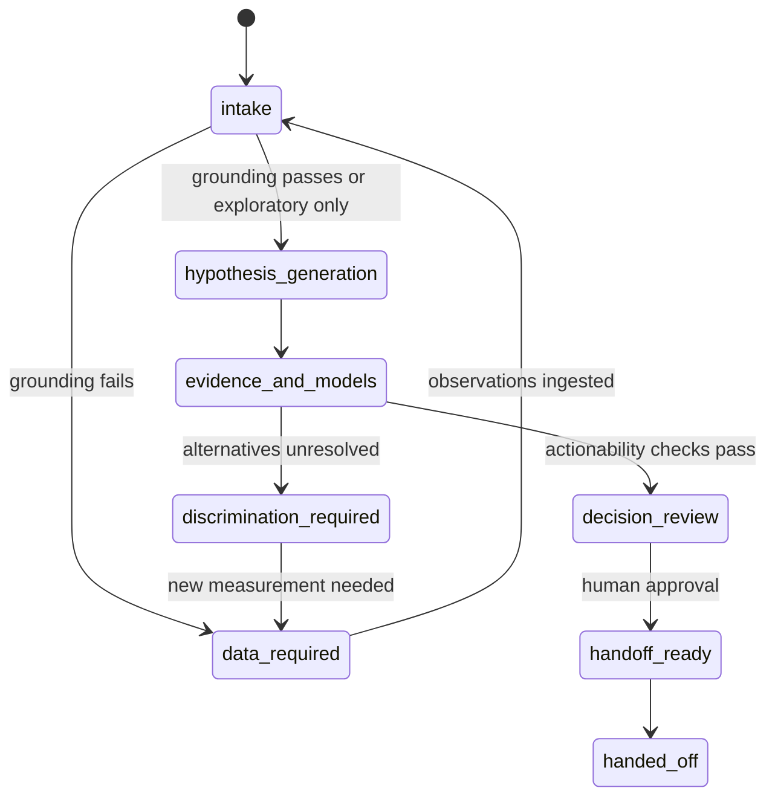
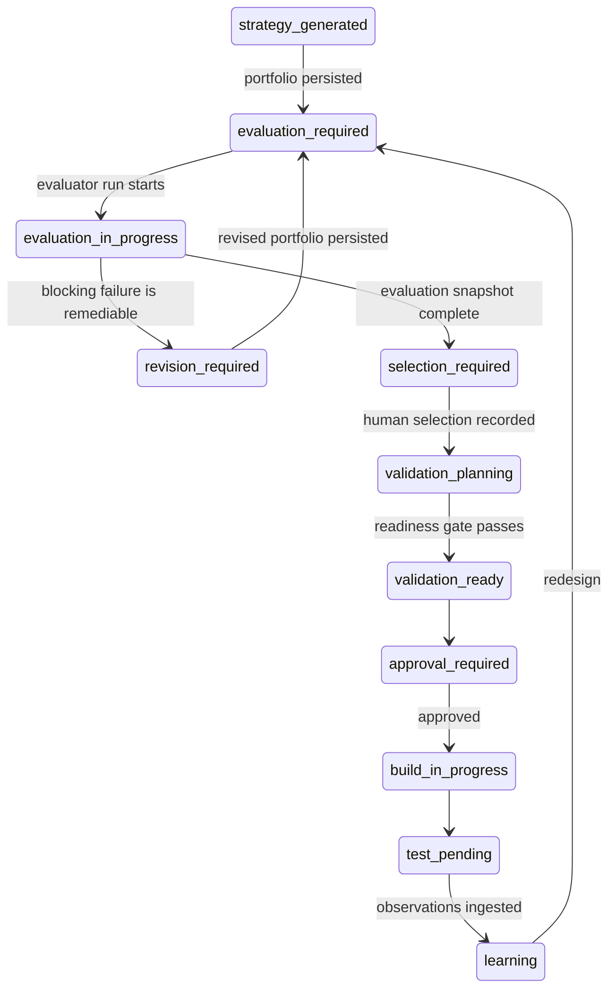

# P0 Gap Resolution Architecture Design

> Status: architecture baseline for implementation; no production implementation is claimed.
> Date: 2026-08-12
> Scope: P0-1 observation-grounded diagnosis, P0-2 evaluator/selection closed loop, P0-3 project-specific validation plan.

## 1. Executive decision

The platform must stop treating a plausible narrative, a generated portfolio, or a generic experiment template as completion. The P0 target is one auditable decision chain:

`goal -> measured observation -> descriptive engineering problem -> causal hypotheses -> evidence/model checks -> candidate designs -> evaluator hard gates/soft scorecard -> human selection -> project-specific validation plan -> experiment -> new observations -> learning/redesign`

This design preserves the teacher's original E. coli K-12 rational-engineering method: quantitative grounding, systematic expert-module coverage, explicit priors, a visible reasoning scaffold, and reusable decision rules. It does not turn the product into a generic chatbot, a black-box optimizer, or an ALE workflow.

The current repository already contains most of the correct nouns. P0 implementation should extend those contracts instead of creating parallel subsystems:

- Reuse `harness.experiments.models.Observation` and `harness.diagnosis.normalizer.normalize_and_commit` as the only route from raw measurements to accepted observations.
- Reuse `DiagnosisSession.baseline_observation_ids`, existing evidence/hypothesis/model-run objects, and the unified workflow run.
- Reuse `DesignEvaluation`, evaluator modules, Pareto decision logic, `BuildTestPackage`, `ExperimentPlan`, observation ingestion, and learning services.
- Add only three missing first-class records: `EngineeringProblem`, `DesignSelectionDecision`, and `ValidationPlan`.

## 2. Scientific contract and non-negotiable semantics

### 2.1 Observation is measurement, not interpretation

An `Observation` is an immutable, QC-qualified measurement with data provenance. It may state that titer was `8.2 g/L`; it must not state that precursor supply was low. “Low precursor supply” is a causal hypothesis. Mixing the two would manufacture certainty before diagnosis begins.

The requested observation vocabulary maps to the existing model as follows:

| Requested concept | Canonical representation | Rule |
|---|---|---|
| project | `project_id` | Must match the diagnosis project. |
| strain | `subject_design_version_id`, `subject_construct_id`, or resolved biological-context reference | At least one resolvable subject identity is required for actionable diagnosis. |
| condition | `condition_ref` plus biological context | Medium, carbon source, process mode, temperature and time must be resolvable when relevant. |
| measurement type | `metric`, `modality`, optional entity namespace/id | Metric is controlled vocabulary, not arbitrary prose. |
| value/unit | `value`, `unit` | Numeric, compatible and normalized before comparison. |
| comparison/reference | `reference_or_baseline` plus explicit comparator observation IDs in `EngineeringProblem` | A free-text baseline is not sufficient for an actionable comparison. |
| source | `data_asset_ids`, `source_type`, analysis-pipeline version, assay ID | Every accepted value must resolve to a data asset or governed external measurement record. |
| confidence | uncertainty, replicates, QC status/flags, detection limit | No vague LLM-supplied confidence scalar. Reliability is derived. |
| abnormality | `EngineeringProblem` | Must remain descriptive; a mechanism belongs in a hypothesis. |

### 2.2 Evidence strength is claim-specific

Evidence labels must say what is established, under which context, and by which method:

- Measured project data and directly applicable validated interventions can be hard evidence for the measured or demonstrated claim.
- Stoichiometric yield bounds and in-model essentiality are computed constraints: hard for what follows from the declared model and assumptions, not proof of in-vivo behavior.
- FBA flux redistribution, OptKnock, docking, FoldX and literature transfer are predictions or priors for biological effect unless independently measured in the target context.
- An expert rule is a rationale prior, never project-specific observation.
- Missing or unresolvable provenance cannot be upgraded by fluent prose.

Every claim used for an actionable decision must carry `claim_id`, supporting/contradicting evidence IDs, applicability result, provenance, and calibrated uncertainty. Metabolic flux/yield/essentiality claims additionally require a project-relevant model run or an explicit `not_computable` reason. For tryptophan work, `e_coli_core` biomass FBA is not target-specific grounding; the model must contain the tryptophan pathway, mapped target exchange/production reaction, substrate constraints, and declared objective.

### 2.3 Two legitimate entry modes

Observation grounding applies to diagnosis of a failed or underperforming system. A greenfield rational-design project with no built strain is allowed, but must enter a distinct `design_from_goal` route. It may use theoretical yield and model analysis, but it must not invent an observed bottleneck or call the result a diagnosis.

## 3. Target architecture

```mermaid
flowchart LR
  A["Raw data / assay file"] --> B["DataAsset + ingestion"]
  B --> C["Observation normalizer and QC"]
  C --> D["Accepted Observation"]
  D --> E["ObservationGroundingGate"]
  E --> F["EngineeringProblem: descriptive delta"]
  F --> G["Diagnosis: hypotheses, evidence, models, tests"]
  G --> H["ActionabilityGate"]
  H --> I["Design objective and strategy modules"]
  I --> J["Candidate portfolio"]
  J --> K["evaluation_required"]
  K --> L["Hard gates + soft scorecard + Pareto"]
  L --> M["selection_required"]
  M --> N["Human DesignSelectionDecision"]
  N --> O["Project-specific ValidationPlan"]
  O --> P["ValidationReadinessGate"]
  P --> Q["ExperimentPlan / approved execution"]
  Q --> R["ExperimentRun and result ingestion"]
  R --> D
  R --> S["Outcome comparison and learning"]
  S --> G
  S --> I
```



One `UnifiedWorkflowRun` remains the cross-domain coordinator. Domain services own their records and transitions; the orchestrator only advances after repository-backed gates pass. Frontend booleans are display hints, never gate authority.

## 4. P0-1: observation-grounded diagnosis

### 4.1 New `EngineeringProblem` record

Add an append-only/versioned record in the diagnosis domain:

```yaml
engineering_problem_id: EPR-...
project_id: PROJ-...
diagnosis_session_id: DIAG-...
subject_observation_ids: [OBS-...]
comparator_observation_ids: [OBS-...]   # or objective_target_ref
objective_target_ref: null
metric: tryptophan_titer
observed_value: 8.2
expected_value: 12.0
unit: g/L
delta_absolute: -3.8
delta_relative: -0.317
comparison_method: matched_baseline
condition_match_status: matched
abnormality_type: below_baseline
abnormality_statement: "Tryptophan titer is 31.7% below the matched baseline."
derivation_provenance: {algorithm: observation_comparator, version: "1"}
grounding_status: grounded
```

Allowed abnormality statements are descriptive differences such as below baseline, above limit, delayed response, or changed ratio. They may not contain causal phrases such as “due to”, “limited by”, “feedback inhibition”, or “low precursor availability”.

### 4.2 `ObservationGroundingGate`

Replace boolean-only sufficiency decisions with a gate that reads persisted records. A diagnosis may become actionable only when all applicable checks pass:

1. At least one accepted observation belongs to the project and resolves to raw provenance.
2. Subject/strain identity, metric, numeric value, unit, condition and timepoint are adequate for the claim.
3. QC passed; uncertainty, replicate summary and detection-limit handling are explicit.
4. A comparator is either a QC-passed compatible observation or a governed project objective target with source and unit.
5. An `EngineeringProblem` can be deterministically reproduced from those inputs.
6. Key phenotype coverage exists; modality coverage gaps are reported, not silently treated as negative results.
7. Claims that require quantitative grounding have appropriate model results or are marked `not_computable` with consequences.

Gate output is structured:

```yaml
status: pass | fail | conditional
blocking_reasons: []
observation_ids: []
engineering_problem_ids: []
missing_fields: []
missing_modalities: []
model_requirements: []
evaluated_at: ...
policy_version: observation-grounding-v1
```

With no observation, permitted states are `data_required` or explicitly exploratory `hypothesis_generation`. The session cannot be actionable, approved, handed off, or described as project-grounded. Human-entered assertions may be stored as assertions and used to request data, but are not measurements.

### 4.3 Diagnosis actionability

`ActionabilityGate` should require, in addition to observation grounding:

- At least one causal hypothesis linked to an engineering problem.
- Supporting and contradicting evidence explicitly assessed.
- A differentiating test or reason it is unnecessary.
- Relevant teacher modules considered: pathway/yield (M1), precursor/redox/pFBA (M2), regulation (M3), enzyme (M4), competition/essentiality (M5), expression/dynamics/toxicity/process when applicable.
- Evidence strength and context applicability are visible.
- The decision includes falsifiers, uncertainty and the exact observation/model/evidence lineage.

### 4.4 Diagnosis state behavior



Exploratory hypotheses remain visibly non-actionable until the grounding gate passes.

## 5. P0-2: evaluator and selection closed loop

### 5.1 Required state correction

Portfolio generation is an artifact event, not completion. The native design state machine becomes:



Implementation may persist `portfolio_generated` as an event/status on the portfolio row, but the design project must land in `evaluation_required`. Legacy projects found in `portfolio_generated` are mapped to `evaluation_required`, never normalized to completed.

### 5.2 Evaluator result contract

Reuse `DesignEvaluation` as the detailed source of truth and extend it additively where needed. The API projection per candidate is:

```yaml
candidate_id: CAND-...
evaluation_result: eligible | ineligible | revision_required
score:
  type: structured_scorecard
  hard_gate_passed: true
  soft_scores: {...}
hard_failures: []
soft_scores:
  expected_benefit: {value: 0.62, scale: probability, basis_refs: [MRUN-...], uncertainty: 0.18}
  evidence_strength: {value: medium, basis_refs: [EV-...]}
  feasibility: {value: high, basis_refs: [BUILDCHK-...]}
  validation_burden: {value: medium, basis_refs: [REQ-...]}
ranking:
  pareto_front: 1
  preference_rank: null
  preference_policy_ref: null
selection_status: not_selected
reason: "Eligible; expected benefit is model-supported but uncertain."
```

There is no opaque weighted scalar. `score` is a structured scorecard. Pareto rank is computed across eligible candidates. A total preference rank is only allowed if explicit user/project preferences and policy version are supplied. The baseline/control is evaluated but excluded from selectable candidates.

### 5.3 Hard gates

Any unresolved blocking failure makes a candidate ineligible or sends it to revision:

- Missing minimum evidence or evidence references that cannot be resolved.
- A material claim unsupported by evidence/model/observation.
- Unresolved contradiction that invalidates the proposed mechanism or expected effect.
- Essentiality or severe growth-coupling risk under the declared host/model/context.
- Build infeasibility: unresolved target, invalid construct logic, incompatible operations, absent required resource, or governance prohibition.
- Missing provenance for intervention, target, model run, or numerical prediction.
- Non-testable mechanism or no project-specific validation route.

Overrides require a governed exception record with actor, reason, scope, expiry and compensating validation; they never erase the original failure.

### 5.4 Soft scorecard

Eligible candidates are compared on:

- Expected benefit, distinguished as intended, literature-observed, model-predicted, or project-measured.
- Evidence strength and target-context applicability.
- Build/process feasibility.
- Biological and model uncertainty.
- Validation burden, time, assay complexity and information gain.
- Trade-offs: growth, burden, by-products, robustness, toxicity and process compatibility.

Every soft entry carries value, scale/direction, basis references, computability and uncertainty. `unknown` is valid and must not silently become a neutral numeric score.

### 5.5 New `DesignSelectionDecision`

Evaluation recommendation is not authorization. Add an append-only selection record:

```yaml
selection_decision_id: SEL-...
project_id: PROJ-...
design_project_id: EDP-...
portfolio_id: PORT-...
evaluation_ids: [DEVAL-...]
selected_candidate_ids: [CAND-...]
rejected_candidates:
  - candidate_id: CAND-...
    reason_code: hard_gate_failure | dominated | preference | defer
    reason: ...
explicit_preferences: {...}
actor_id: ...
actor_role: engineer
decision_status: confirmed
created_at: ...
```

Candidate `selection_status` may be materialized for fast reads, but this record is authoritative. Only eligible candidates may be selected unless a valid governed exception exists. At least one reason is required for every rejection/defer action.

## 6. P0-3: project-specific validation plan

### 6.1 Aggregate, not a duplicate experiment model

Add `ValidationPlan` as the design-to-experiment traceability aggregate. It links a selected candidate and its diagnostic rationale to the existing rich `BuildTestPackage`; once ready, it produces/links the existing `ExperimentPlan`.

```yaml
validation_plan_id: VPLAN-...
project_id: PROJ-...
design_project_id: EDP-...
selection_decision_id: SEL-...
candidate_id: CAND-...
candidate_version: 3
engineering_problem_ids: [EPR-...]
hypothesis_ids: [HYP-...]
mechanism_to_test: ...
conditions: [...]             # host, medium/carbon source, process, time
controls: [...]               # baseline, negative, positive where applicable
replication_plan: {...}
sampling_plan: {...}
measurements:
  primary: [...]
  mechanism: [...]
  safety_tradeoff: [...]
qc_requirements: [...]
success_criteria: [...]
failure_criteria: [...]
decision_rules: [...]         # advance, revise, reject, diagnose again
build_test_package_id: BTP-...
experiment_plan_id: null
status: draft | insufficient | ready | approved | executing | completed
version: 1
provenance: {...}
```

The plan is invalid if it merely says “measure titer” or contains placeholders. Criteria require metric, unit, comparator, threshold/direction, time/condition and missing-data handling. Mechanism readouts must discriminate the selected hypothesis from at least one alternative when alternatives remain plausible.

### 6.2 Validation readiness gate

`ValidationReadinessGate` passes only when:

1. A confirmed selection decision identifies an eligible candidate and immutable candidate version.
2. The build scope is concrete and passes buildability/governance checks.
3. Project context identifies host/strain, medium or carbon source, relevant process mode and sampling conditions.
4. Primary phenotype, mechanism, and major trade-off readouts are specified.
5. Controls, biological/technical replication, sampling and QC are explicit.
6. Success and failure criteria are machine-evaluable.
7. Decision rules map outcomes to advance, revise, reject, or reopen diagnosis.
8. Each field has provenance: human, candidate, diagnosis, evidence, model or deterministic derivation.

An LLM may draft a scaffold, but unresolved placeholders leave the plan `insufficient`. Only after readiness may the service create an `ExperimentPlan` and request human approval.

### 6.3 Results and learning

Experiment results enter through the existing ingestion/normalization path and become new `Observation` records. A deterministic outcome comparator evaluates them against the frozen validation-plan version and writes an outcome record containing observed deltas, met/unmet criteria, protocol deviations and uncertainty. Learning then:

- updates hypothesis support rather than rewriting history;
- records failure cases and candidate/design version lineage;
- reopens diagnosis when the causal model is falsified;
- returns to evaluator-required redesign when the mechanism remains credible but the intervention fails;
- never promotes a general rule from one project without applicability and review.

## 7. API design

Existing endpoints remain; additions and behavior changes are versioned/additive.

### 7.1 Diagnosis

- `POST /diagnosis/sessions/{id}/observations:normalize` — thin wrapper over the existing normalizer; returns accepted/rejected records and QC issues.
- `GET /diagnosis/sessions/{id}/grounding` — repository-backed grounding report.
- `POST /diagnosis/sessions/{id}/engineering-problems:derive` — deterministic observation comparison; idempotent by input/version key.
- `GET /diagnosis/sessions/{id}/engineering-problems`.
- Existing session action/approval/handoff endpoints return `409 gate_blocked` with structured reasons when grounding/actionability fails.

### 7.2 Engineering design

- Portfolio generation response includes `next_state: evaluation_required`.
- `POST /engineering-design/portfolios/{id}/evaluate` is idempotent per portfolio version/evaluator policy and returns evaluation snapshot IDs.
- `GET /engineering-design/projects/{id}/evaluation-summary` returns hard failures, soft scorecards, Pareto fronts and provenance.
- `POST /engineering-design/projects/{id}/selection-decisions` records human selection with optimistic concurrency on portfolio/evaluation versions.
- `GET /engineering-design/projects/{id}/selection-decisions/latest`.
- Existing planning/build endpoints return `409 selection_required` before a confirmed selection.

### 7.3 Validation and experiments

- `POST /engineering-design/projects/{id}/validation-plans:draft` requires selection decision ID.
- `PATCH /engineering-design/validation-plans/{id}` creates a new version rather than mutating an approved version.
- `GET /engineering-design/validation-plans/{id}/readiness`.
- `POST /engineering-design/validation-plans/{id}:materialize-experiment-plan` requires readiness pass and is idempotent.
- Existing experiment ingestion returns created observation IDs and the matched validation-plan version.

All mutation endpoints accept idempotency keys; state-changing endpoints use expected version/ETag semantics and return audit/event IDs.

## 8. Frontend design by function

The UI should expose work, evidence and blockers, not add decorative cards.

### Diagnosis workbench

- Observation intake/import with subject, condition, units, replicates, QC and source provenance.
- Side-by-side observed vs baseline/target comparison and derived delta preview.
- Grounding checklist showing exact missing fields/data and why actionability is blocked.
- Clear separation of “measured observation”, “descriptive abnormality”, and “causal hypothesis”.
- Model-grounding panel that shows model identity, objective, constraints, reaction mapping and limitations.

### Design project detail

- A mandatory Evaluation stage after portfolio generation.
- Candidate comparison table with hard-gate outcome, expandable failures, claim/evidence links, soft scorecard, uncertainty and Pareto front.
- Selection workspace requiring explicit selected/rejected/deferred status and reasons; no implicit “top candidate wins”.
- Version banners so the user knows which portfolio/evaluation snapshot is being selected.

### Validation workspace

- Traceability header from engineering problem -> hypothesis -> candidate -> selection.
- Editable conditions, controls, replication, sampling, readouts, QC, thresholds and decision rules.
- Machine-evaluable criterion preview and readiness blockers.
- Experiment and result status, followed by observed-vs-predicted comparison and next-decision explanation.

Relevant current files include `frontend/src/api/diagnosis.ts`, `frontend/src/api/engineeringDesign.ts`, `frontend/src/api/experiments.ts`, `frontend/src/api/orchestrator.ts`, `RunNewDiagnosisPage.tsx`, `DiagnosisSessionDetailPage.tsx`, `DesignProjectDetailPage.tsx`, `DesignWorkbenchPage.tsx`, and `CandidateDetailDrawer.tsx`.

## 9. Persistence, migration and compatibility

The repository uses SQLAlchemy metadata plus the in-repository migration runner (`harness/migrations.py`), so P0 changes must be expressed as idempotent schema steps and verified on SQLite and PostgreSQL-compatible semantics.

### New tables

- `diagnosis_engineering_problems` with project/session/observation foreign keys, deterministic comparison fields, provenance JSON and version.
- `design_selection_decisions` and child candidate-decision rows, append-only.
- `design_validation_plans` with candidate/version/selection links, structured plan fields, status/version and links to build-test/experiment records.

### Additive columns/indexes

- Add policy/evaluation snapshot and native state support where current design records lack them.
- Add evaluation projection fields only if not reproducible from the existing `DesignEvaluation`; detailed vectors remain canonical.
- Index project/session/status, portfolio/evaluation version, candidate/selection, validation status and idempotency keys.

### Existing data classification

- Existing observations remain valid only if current QC/provenance/subject fields pass the new gate; no synthetic backfill.
- Historical diagnosis sessions with no observations become `legacy_ungrounded`; their reports remain readable but cannot be newly approved or handed off without grounding.
- Historical `portfolio_generated` projects become resumable `evaluation_required`; they are not marked complete.
- Historical evaluations are `legacy_evaluation` until policy/version/provenance requirements pass; no fabricated hard-failure or soft-score data.
- Existing build-test packages remain drafts. They become validation-ready only through a linked selection decision and readiness gate.

Roll out behind policy flags in observe-only, enforce-on-new, then enforce-on-all-active stages. Audit mismatches before each enforcement step. Rollback disables enforcement and routing, but never deletes new records or rewrites audit history.

## 10. Failure handling and auditability

- Gate failures are domain results (`data_required`, `evaluation_required`, `selection_required`, `validation_insufficient`), not 500 errors.
- Partial evaluator runs are not selectable; resume from immutable snapshots.
- Stale selections fail optimistic concurrency when portfolio/evaluation versions changed.
- Approved validation plans are immutable; amendment creates a new version and invalidates pending materialization where necessary.
- Every automated result stores code/policy/model version, inputs, timestamp and provenance.
- Every human decision stores actor, role, reason and exact reviewed versions.

## 11. Acceptance traceability

| P0 gap | Architectural proof required | Runtime acceptance evidence |
|---|---|---|
| P0-1 | Observation is canonical; engineering problem is derived; repository-backed gate blocks ungrounded actionability | A no-observation session returns `data_required`; a QC-passed matched pair produces a reproducible delta; handoff is impossible until pass. |
| P0-2 | Project state enters `evaluation_required`; evaluator produces hard/soft/Pareto result; human selection is persisted | Generated portfolio is not completed; a hard-failed candidate cannot be selected; selected/rejected reasons and snapshot versions are auditable. |
| P0-3 | Selected candidate creates a project-specific ValidationPlan linked to BuildTestPackage and ExperimentPlan | Generic/placeholder plan fails readiness; a concrete plan materializes an experiment; ingested results become observations and trigger deterministic outcome/learning. |

The end-to-end scientific fixture must use a target-capable E. coli K-12 model and a tryptophan project with real/mocked-but-explicit test data assets. It must demonstrate the full lineage, not merely endpoint availability.

## 12. Final four-way review

- **Scientific rigor: PARTIAL.** The design prevents observations, hypotheses and model predictions from being conflated and restores quantitative/contextual grounding. Runtime proof still has to be implemented and exercised on a target-capable tryptophan case.
- **Engineering completeness: PARTIAL.** Contracts, transitions, APIs, migration and compatibility are specified against existing repository components. No production code or schema has been changed in this design phase.
- **Experimental executability: PARTIAL.** Required controls, replication, readouts, criteria and decision rules are defined, but no project-specific validation plan has yet been generated and approved through the new gate.
- **Teacher-design closure: PARTIAL.** The planned chain matches the original M0-M11 rational-engineering loop, including evaluator rejection and experimental learning. Closure requires implementation plus end-to-end acceptance evidence.

Overall P0 status after this document: **DESIGN COMPLETE / IMPLEMENTATION NOT STARTED / ACCEPTANCE PARTIAL**.
