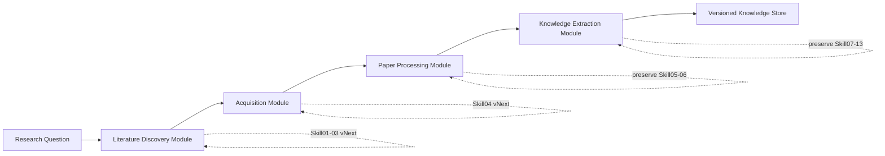
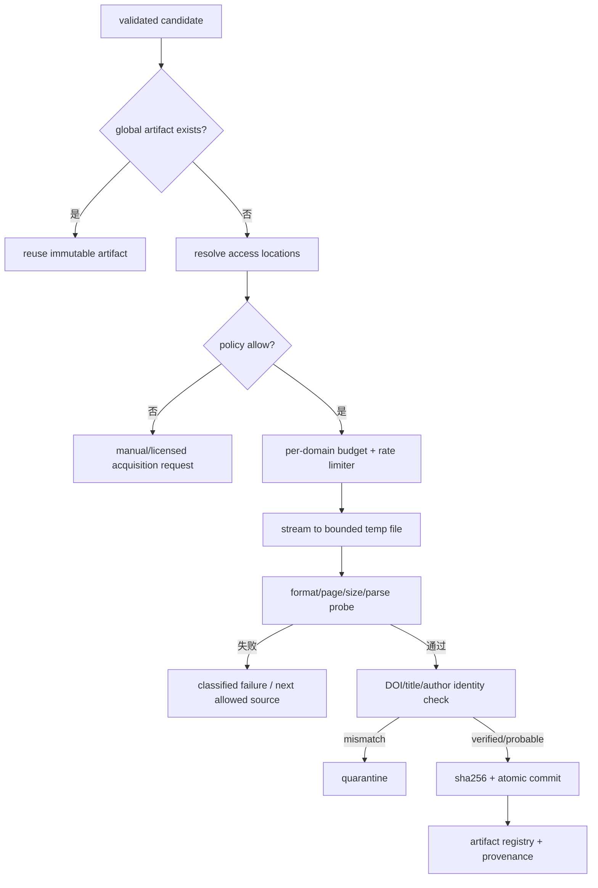
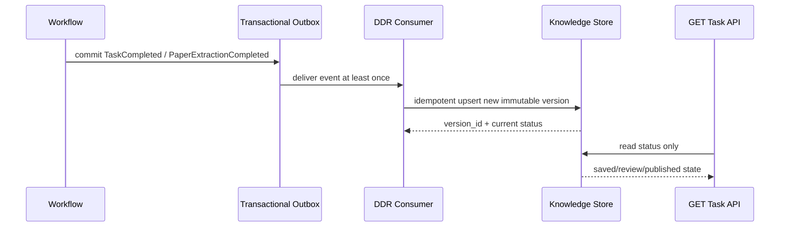

# WAVE 文献发现与获取目标设计建议

> 状态：设计建议，不是已实现功能。  
> 原则：保留 `Skill05-13` 的成熟能力；以版本化契约逐步升级 `Skill01-04`；先保证召回、身份正确性、合规和可追溯，再扩大吞吐。

## 1. Architecture Decision

采用 **Option C：模块化重构**，具体落地为“四模块、兼容式迁移”：



### 为什么不是单纯修补或新增单体 Skill00

- **Option A 只修补现有实现**不能充分解决统一候选实体、合规策略、PDF 身份验证、跨任务调度和完成事件入库等跨阶段问题。
- **Option B 新增 Skill00**容易把需求解析、搜索、排序、核验、下载继续堆在一个组件中，并与现有 `Skill01-04` 重叠。
- **Option C**允许先定义边界和契约，再逐个替换内部实现；旧工作流仍可通过兼容 adapter 调用，不需要一次性迁移数据库或前端。

## 2. Module Boundaries

### 2.1 Literature Discovery Module

职责：把研究意图转换为可审计的多源查询，召回、归并、排序并核验论文候选。内部包含：

1. `IntentNormalizer`：双语规范化物种、菌株、产品、表型、目标、机制、时间、文献类型和排除条件。
2. `QueryPlanner`：生成宽召回、精准匹配、机制扩展、引文扩展四类 query plans。
3. `SourceQueryCompiler`：把规范意图编译成 PubMed、Europe PMC、Crossref、OpenAlex 等来源特定语法。
4. `SourceAdapters`：只处理来源 API、分页、字段映射、速率反馈和原始响应指纹。
5. `CandidateEntityResolver`：跨来源合并 DOI、PMID、PMCID、OpenAlex ID、S2 ID、预印本与正式版本。
6. `RecallRanker`：保证核心概念覆盖并保留探索性候选。
7. `PrecisionRanker`：使用题名、摘要、关键词、MeSH、期刊、年份、文献类型和正负领域特征精排。
8. `CitationResolver`：以多源证据核验标识符和书目元数据，输出三态/多态决策与证据。

模块输出是候选实体，不负责下载字节。

### 2.2 Acquisition Module

职责：从已核验候选获得允许访问、身份正确、可解析的论文制品。内部包含：

1. `AccessResolver`：查询 PMC/Europe PMC、OpenAlex OA locations、Unpaywall、Semantic Scholar、Crossref links、机构仓储和用户授权上传。
2. `PolicyGate`：基于来源 allowlist、许可、访问方式和项目政策决定是否可自动获取。
3. `Downloader`：流式临时文件、最大体积、超时、退避、每域速率限制、校验后原子提交。
4. `ContentIdentityValidator`：文件格式、页数、可解析性、内嵌 DOI、题名/作者相似度和候选版本关系。
5. `ArtifactRegistry`：以规范 DOI、内容 checksum 和版本关系做全局幂等登记。

模块输出是不可变 `PaperArtifact`，不做 MinerU 解析。

### 2.3 Paper Processing Module

职责：把不可变 PDF 转为结构化、带位置映射的干净文档。

- 保留 MinerU hybrid → pipeline → PyMuPDF 的降级序列，但显式标记质量等级，避免把 fallback 结果视为与 MinerU 等价。
- 保留 `Skill05/06` 的内容寻址缓存。
- 为 MinerU 建立全局 GPU/进程配额，而不是每任务自行并发。
- 原始 Markdown、clean Markdown、clean JSON、图表制品和所有映射都不可变并带父制品 checksum。
- 清洗只做可重放的确定性变换；任何语义修补进入人工 review patch，不覆盖机器清洗结果。

### 2.4 Knowledge Extraction Module

职责：从 clean document 形成有证据锚点、可审核、可版本化的知识对象。

- 保留 `Skill07` Schema/语义契约/缓存与 `Skill08-13`。
- 把长文抽取拆成 section-level evidence harvesting 与 paper-level synthesis，降低长上下文成本。
- 每条 design/claim 必须指向 `document_version + paragraph/table/figure anchor`。
- DDR 状态区分 `draft`、`review_required`、`reviewed`、`published`。
- 工作流完成通过 event/outbox 触发幂等保存，不依赖 GET 查询。
- 重跑创建新版本；`current` 指针可更新，但旧版本不可覆盖。

## 3. Core Versioned Contracts

以下是逻辑契约草案，字段名可在实现阶段映射到现有 Schema；本次不要求修改数据库。

### 3.1 `ResearchIntent vNext`

```yaml
intent_id: stable hash
raw_question: string
normalized:
  organism: Escherichia coli
  strain_family: K-12
  strains: [MG1655, W3110, BW25113]
  product: L-tryptophan
  product_synonyms: [tryptophan, L-tryptophan, Trp, 色氨酸, L-色氨酸]
  goals: [increase_titer, increase_yield, increase_productivity]
  mechanisms: [metabolic_engineering]
constraints:
  years: {from: 2000, to: 2026}
  publication_types: [journal_article, preprint]
  exclude_domains: [clinical_infection, food_contamination]
ontology_version: string
parser_version: string
```

年份不应全局硬编码为 2020–2026。综述/最新进展查询可以偏近期，机制与奠基证据查询必须允许更早年份。

### 3.2 `QueryPlan vNext`

```yaml
query_id: stable hash
intent_id: string
purpose: recall | precision | mechanism | citation_expansion
source: pubmed | europe_pmc | crossref | openalex
canonical_concepts: [...]
compiled_query: string
filters: {...}
budget: {max_pages: int, max_results: int}
compiler_version: string
created_at: timestamp
```

### 3.3 `DiscoveryCandidate vNext`

```yaml
candidate_id: stable entity id
identifiers:
  doi: normalized DOI or null
  pmid: string or null
  pmcid: string or null
  openalex_id: string or null
  semantic_scholar_id: string or null
bibliography:
  title: string
  abstract: string or null
  authors: [...]
  journal: string or null
  year: int or null
  publication_type: string
  keywords: [...]
versions:
  relation: preprint | version_of_record | correction | unknown
provenance:
  - source: string
    query_id: string
    source_record_id: string
    retrieved_at: timestamp
    raw_response_hash: string
scores:
  recall: float
  precision: float
  confidence: float
  explanations: [...]
validation:
  state: accepted | rejected | needs_review
  evidence: [...]
```

### 3.4 `PaperArtifact vNext`

```yaml
artifact_id: sha256
candidate_id: string
canonical_doi: string or null
access:
  source: string
  source_url: string
  access_type: open_access | user_upload | licensed
  license: string or unknown
  policy_decision_id: string
download:
  requested_at: timestamp
  completed_at: timestamp
  bytes: int
  mime: application/pdf
identity_validation:
  state: verified | probable | mismatch | unreadable
  embedded_doi_match: bool | null
  title_similarity: float | null
  pages: int | null
  parse_probe: pass | fail
parent_artifact_id: string or null
```

## 4. Query Design for E. coli K-12 / L-tryptophan

### 4.1 规范概念组

| 概念 | 必选/扩展 | 示例词 |
|---|---|---|
| 物种 | 必选 | `Escherichia coli`, `E. coli` |
| 菌株 | 精确查询必选，宽召回可选 | `K-12`, `MG1655`, `W3110`, `BW25113` |
| 产品 | 必选 | `L-tryptophan`, `tryptophan`, `Trp` |
| 生产目标 | 至少一组 | `production`, `overproduction`, `biosynthesis`, `titer`, `yield`, `productivity` |
| 工程机制 | 扩展 | `metabolic engineering`, `pathway engineering`, `feedback resistant`, `transporter`, `cofactor`, `adaptive laboratory evolution` |
| 排除领域 | 精排负向特征 | clinical, infection, patient, pathogen, food contamination, detection |

### 4.2 查询族，而不是单一查询

```text
Q1 精确底盘：("Escherichia coli" OR "E. coli") AND (K-12 OR MG1655 OR W3110 OR BW25113)
             AND (tryptophan OR "L-tryptophan")
             AND (production OR biosynthesis OR titer OR yield OR productivity)

Q2 工程机制：("Escherichia coli" OR "E. coli") AND (tryptophan OR "L-tryptophan")
             AND ("metabolic engineering" OR "pathway engineering" OR "feedback resistant"
                  OR transporter OR "adaptive laboratory evolution")

Q3 机制迁移：("aromatic amino acid" OR shikimate OR chorismate)
             AND ("Escherichia coli" OR "E. coli")
             AND (engineering OR production)

Q4 综述/引文种子：("L-tryptophan production" AND "Escherichia coli")
                   AND (review OR bibliometric seed)
```

每个来源由 compiler 生成自己的字段、短语、日期和文献类型语法。Crossref 不应收到未经处理的 PubMed `[Title/Abstract]` 语法；OpenAlex 也不应默认只按引用数排序。

### 4.3 两阶段排序

**RecallRanker 硬约束与加分：**

- 物种和产品概念至少各命中一次；
- K-12/目标菌株、生产目标、工程机制、实验数据词分别加分；
- 缺摘要不直接拒绝，但降低置信度并保留少量探索配额；
- 每来源、每查询族保留最低配额，避免单一来源垄断前 K。

**PrecisionRanker 特征：**

- 标题与摘要的核心概念覆盖；
- K-12/菌株证据；
- titer/yield/productivity、g/L、mg/L、mol/mol 等实验结果词；
- 基因/通路干预、发酵条件、对照设计等实验性信号；
- 临床、感染、宿主、食品污染、检测等负向特征；
- 文献类型、版本状态、年份和来源一致性；
- 模型得分必须附 explanation，不能覆盖确定性硬规则。

### 4.4 评测门槛

用人工双人标注的专项集评估：

- 候选召回：Recall@20、Recall@50；
- 排序质量：Precision@10、nDCG@20；
- 实体归并：DOI/题名版本 merge precision/recall；
- 领域排除：临床/污染负样本进入 Top-10 的比例；
- 稳定性：相同 intent/adapter version 下查询与结果可重放。

在专项指标未优于当前基线前，不扩大自动下载数量。

## 5. Source Strategy

### 第一批正式来源

1. **PubMed**：生命科学主题词、PMID、出版类型；保留现有 adapter，补分页、缓存和速率策略。
2. **Europe PMC**：摘要、PMCID 和 OA 连接；与 PubMed 做标识符归并而非简单叠加。
3. **Crossref**：DOI 注册元数据和版本关系；统一仓库内两套客户端的底层传输与规范化逻辑。
4. **OpenAlex**：新增正式搜索 adapter。参考 ZIP 的分页、429 退避和字段解析可以作为实现素材，但必须接入 WAVE 契约。

### 第二批、评估后接入

- **Semantic Scholar Search**：只有在 API key、速率政策、字段许可和覆盖度评估完成后接入。
- **引文扩展**：优先用 OpenAlex/Europe PMC/Semantic Scholar 的公开关系，不抓取 Google Scholar 页面。
- **本地 DDR**：作为内部证据候选来源加入统一 entity resolver，但要明确“内部知识”与“外部书目记录”的 provenance。

### 暂不接入

- Google Scholar 网页抓取、未配置 Web of Science/CNKI；
- Sci-Hub；
- cloudscraper/浏览器指纹绕过；
- 未经授权的出版商 URL 猜测或批量抓取。

## 6. Acquisition Policy and Flow



### 下载状态必须可区分

- `not_attempted`
- `policy_blocked`
- `rate_limited_retryable`
- `source_unavailable`
- `paywalled_manual_required`
- `downloaded_unverified`
- `identity_mismatch`
- `verified`
- `parse_probe_failed`

不能再用一个笼统 `not_found` 混合版权墙、临时限流、来源故障、错误 PDF 和真实无 OA 版本。

## 7. Execution and Idempotency

### 阶段 Job 模型

```text
discovery(intent_id, query_plan_version)
resolve_candidate(candidate_id, resolver_version)
acquire(candidate_id, acquisition_policy_version)
parse(artifact_sha256, parser_policy_version)
clean(document_sha256, cleaner_version)
extract(clean_document_sha256, model+schema+contract version)
bind(extraction_id, document_version)
publish(task_id, governance_policy_version)
```

每个 job 都有稳定幂等键、租约、尝试次数、结构化错误、next retry time 和不可变输出引用。阶段之间传 ID，不传巨型内存对象。

### 全局资源治理

- HTTP：按域名 token bucket + 全局连接上限；尊重 `Retry-After`。
- MinerU：跨任务统一 GPU/进程 semaphore；按 PDF 页数/大小估算权重。
- 模型：按 token 预算、模型并发和项目配额排队；超长论文使用 section 分片。
- 存储：下载到临时路径，校验成功后原子提交；失败临时文件定期清理。
- 任务：单篇失败不阻塞整批；批次状态由各 paper state 聚合。

## 8. Knowledge Publication

### 用完成事件代替 GET 副作用



### 治理状态

| 状态 | 可见范围 | 进入条件 |
|---|---|---|
| `draft` | 任务与项目内部 | 抽取完成且 Schema 合法 |
| `review_required` | 审核队列 | 证据不足、身份 probable、质量阈值不足或政策要求 |
| `reviewed` | 项目知识查询 | 人工通过或可信自动策略通过 |
| `published` | 全局/下游生成 | 通过发布政策并记录审批人/策略版本 |
| `superseded` | 历史可查 | 新版本成为 current，旧版本不删除 |

## 9. Observability and Quality Gates

### 漏斗指标

```text
queries issued
→ raw records
→ normalized candidates
→ unique entities
→ top-K relevant
→ citation accepted
→ access allowed
→ PDF downloaded
→ PDF identity verified
→ parse quality passed
→ extraction contract passed
→ evidence quality passed
→ reviewed/published DDR
```

每一步至少记录 count、率、耗时、重试、缓存命中、来源/模型成本和失败类别。按 source、query family、organism/product、parser path 和 model version 分组。

### 发布前质量门

- 引文：标识符与核心书目一致；
- 制品：论文身份 `verified`，或 `probable` 且人工确认；
- 解析：质量等级满足抽取最低门槛；
- 抽取：Schema/语义契约通过；
- 证据：关键结论有可定位证据；
- 治理：来源/许可、版本与审批状态完整。

## 10. Migration Plan

### Phase 0：基线与契约，不改生产行为

1. 建立 L-tryptophan 专项金标准和查询回归集。
2. 导出现有管线的候选漏斗作为 baseline。
3. 定义上述 vNext 契约及旧输出 adapter。
4. 记录生产当前的来源成功率、正确 PDF 率和入库完成率。

### Phase 1：影子发现

1. 增加产品/菌株/目标本体和来源特定 query compiler。
2. 把参考 ZIP 的 OpenAlex 合法 API 思路改写成 WAVE adapter。
3. 新候选实体与两阶段排序只做 shadow run，不触发下载或入库。
4. 与现有 `Skill02/03` 对照评测，达到门槛后再切换候选来源。

### Phase 2：安全获取

1. 增加流式下载、每域速率、重试分类和许可策略。
2. 增加 PDF DOI/题名身份闸门与全局 artifact 去重。
3. 新 Acquisition Module 先代理现有 `Skill04` 输出契约。

### Phase 3：可靠发布

1. 新增完成事件/outbox 和幂等 DDR consumer。
2. GET API 改为纯读取；双写/对账一段时间后移除旧副作用。
3. 引入不可变 DDR 版本和治理状态。

### Phase 4：规模化

1. 阶段 durable queue、dead-letter、全局 GPU/模型背压。
2. 受控容量测试：10、50、100、500、1000 篇阶梯负载。
3. 只有错误预算、恢复演练、成本预算和来源条款都通过后，才放宽每任务 8 篇限制。

## 11. Acceptance Criteria

### P0 完成标准

- 所有中英文 L-tryptophan 回归问题都生成包含物种、产品和生产目标的可审计查询；
- OpenAlex shadow adapter 有分页、重试、限速、缓存、provenance 和契约测试；
- Top-10 临床/污染负样本率明显低于当前基线，同时 Recall@20 不下降；
- 自动保存的每个 PDF 都有目标论文身份结果，不再只凭 `%PDF` 判成功；
- 工作流完成后无需客户端继续 GET 也能幂等生成待审核 DDR；
- 所有自动获取来源都有访问类型和政策决策记录；Sci-Hub 与反爬绕过不在实现或配置中。

### 扩容前完成标准

- 单篇任务可独立重试且不会重复下载、解析、模型抽取或 DDR 发布；
- HTTP、MinerU 和模型调用都有跨任务全局配额与背压；
- 任务在 worker 崩溃后可从阶段级状态恢复；
- 100 篇受控任务的正确 PDF、解析、抽取和发布漏斗可完整对账；
- 已完成容量、成本、来源限速和故障恢复报告，而不是仅依赖历史运行样本。

## 12. Immediate Next Design Sprint

建议用一个短周期完成以下五项，不触碰现有生产 Schema：

1. 标注 50–100 篇 L-tryptophan 候选，至少包含 20% 明确负样本。
2. 写出 `ResearchIntent vNext` 和 `DiscoveryCandidate vNext` JSON Schema 草案及旧格式 adapter 设计。
3. 实现离线/影子 Query Compiler 与 OpenAlex adapter 原型，禁止触发 PDF 下载。
4. 对现有排序和新排序执行同一金标准评测，报告 Recall@K、Precision@K、nDCG 与负样本率。
5. 设计 `PaperExtractionCompleted` 事件、幂等键和 DDR 状态机，完成迁移时序评审。

完成这一步后，团队会有足够证据决定具体代码改造，而不会把“增加来源”和“提高并发”误当作发现质量提升。
