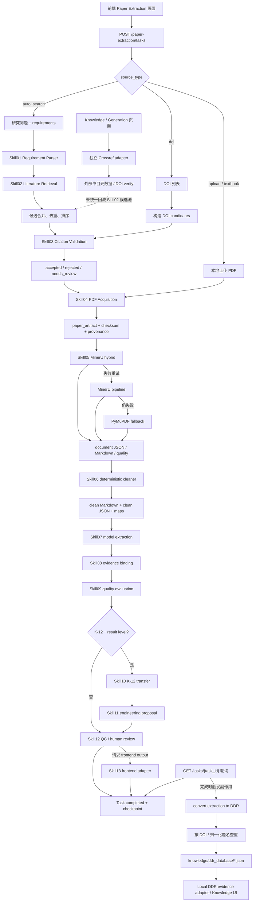
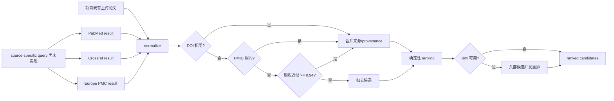
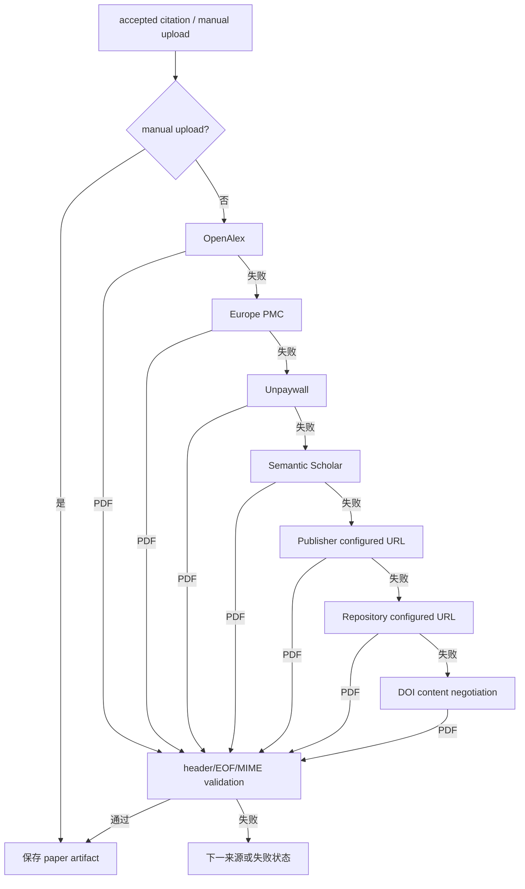

# WAVE 文献管线真实现状流

> 本文只描述 2026-08-12 代码中实际存在并被生产入口调用的行为，不把配置愿景、参考 ZIP 或建议架构画成现状。

## 总览

## 请求模式与执行计划

| 模式 | 实际入口数据 | 实际阶段 | 关键分支 |
|---|---|---|---|
| `auto_search` | 研究问题、目标、要求、最多论文数 | `Skill01 → 02 → 03 → 04 → 05 → 06 → 07 → 08 → 09`，随后 QC/可选 K-12 | 可加入同项目既有上传论文作为 manual candidates |
| `doi` | DOI 列表 | `Skill01 → 03 → 04 → 05 → 06 → 07 → 08 → 09` | 引擎先把 DOI 包装成 candidates，跳过自动检索 |
| `upload` | 上传后保存的本地 PDF | `Skill01 → 04 → 05 → 06 → 07 → 08 → 09` | `Skill04` 登记手工制品，跳过检索和引文核验 |
| `textbook` | 本地文件/文本型来源 | 服务层归一化后进入相应手工来源路径 | API 接受该类型，核心计划主要按上传型处理 |

执行计划来源：`harness/paper_extraction/vendor/paper_experimental_design_extraction/workflow/engine.py:238-253`；DOI candidate 构造见 `engine.py:255-258`；请求归一化见 `harness/paper_extraction/service.py:137-170`。

## 阶段事实表

| 阶段 | 实际输入 | 实际输出 | 真实实现与限制 |
|---|---|---|---|
| Skill01 需求解析 | 用户自然语言、目标与要求 | `research_intent`、concept groups、queries、retrieval strategy | 确定性规则为主；默认来源为 PubMed/Crossref/Europe PMC；中文产品词没有完整英文规范化 |
| Skill02 文献检索 | intent、queries、limit、manual candidates | ranked candidates、source status、provenance | 来源→查询双层串行；DOI/PMID/题名去重；可选 Kimi 重排头部候选；无检索缓存 |
| Skill03 引文核验 | candidates 或 DOI candidates | accepted/rejected/needs_review | DOI、题名+作者、关键词+期刊三种搜索；Crossref/PubMed/Europe PMC；逐候选串行；无缓存 |
| Skill04 PDF 获取 | 已核验候选、上传 PDF、policy | paper artifacts、失败/推迟项 | 候选和下载来源顺序尝试；格式校验不等于论文身份校验；全局去重与统一限速不足 |
| Skill05 PDF 解析 | paper artifact | document JSON、Markdown、质量报告 | MinerU hybrid → MinerU pipeline → PyMuPDF；生产层按 PDF checksum + parse policy 缓存 |
| Skill06 清洗 | document | clean Markdown、clean JSON、sections/paragraphs/figures/tables/citations maps | 确定性清洗与验证；生产层按文档内容缓存 |
| Skill07 设计抽取 | clean JSON、Schema、语义契约 | 结构化 experimental designs | 模型调用、契约校验、内容缓存；生产默认模型配置与类名/文档存在命名漂移 |
| Skill08 证据绑定 | Skill07 + clean document | evidence-bound designs | 用清洗后的定位信息绑定段落/证据 |
| Skill09 质量评价 | evidence-bound designs | quality assessment | 在主自动检索计划内执行 |
| Skill10/11 | K-12 目标与所需结果层级 | 迁移评估、工程建议 | 条件阶段，并非所有任务都执行 |
| Skill12/13 | 上游结果、QC 状态、前端需求 | 审核态、前端 JSON | QC 始终进入；前端适配按请求条件执行 |
| DDR 转换/保存 | 已完成任务中的抽取结果 | DDR 2.0 JSON | 由 GET 状态轮询触发；按 DOI/题名查重；本地 JSON 可选 Git sync |

## 真实检索来源矩阵

| 来源 | `Skill02` 自动检索 | `Skill03` 核验 | `Skill04` PDF 定位 | 备注 |
|---|---:|---:|---:|---|
| PubMed | 是，默认 | 是 | 间接经 PMC/Europe PMC | 真实 NCBI API |
| Crossref | 是，默认 | 是 | 是 | 仓库另有一套知识页 Crossref 客户端 |
| Europe PMC | 是，默认 | 是 | 是 | 真实 API |
| OpenAlex | 否 | 否 | 是 | 当前只查 OA PDF 位置 |
| Semantic Scholar | 否 | 否 | 是 | 当前只查 `openAccessPdf` |
| Google Scholar | 否 | 否 | 否 | adapter 主动报需批准 provider |
| Web of Science | 否 | 否 | 否 | 未配置占位 |
| CNKI | 否 | 否 | 否 | 不可用占位 |
| Unpaywall | 否 | 否 | 条件可用 | 需要联系邮箱；当前环境未配置 |
| 本地 DDR | 不进入自动候选池 | 否 | 否 | 由独立 Local DDR adapter 提供知识查询 |

`Skill02` 虽在默认来源表中列出更多来源，但正常 `Skill01` 自动检索请求只选择 PubMed、Crossref、Europe PMC。因此“代码中有 adapter 名称”和“生产自动检索会调用”必须区分。

## 候选数据流

确定性排名实现见 `harness/paper_extraction/vendor/skills/skill02_literature_retrieval/ranking/relevance_ranker.py:19-44`。它拼接题名、期刊与作者来计算匹配，没有将摘要纳入特征；因此图中的 `ranking` 不能被理解为全文或摘要语义相关性模型。

## PDF 获取真实顺序

这里没有 Sci-Hub；它只存在于参考 ZIP 的说明，不属于当前 WAVE 生产链。

## 存储与状态

| 制品/状态 | 位置/机制 | 特征 |
|---|---|---|
| 上传 PDF | `harness/paper_extraction/storage/uploads` | 服务接收后落盘 |
| 下载/论文制品 | 运行存储下的 paper artifacts | checksum、version、source provenance；去重域主要限于 paper_id |
| 工作流 checkpoint | runtime task/run 目录 | 可恢复已登记的任务和阶段上下文 |
| Skill05/06 cache | pipeline cache | 内容寻址，避免重复解析/清洗 |
| Skill07 cache | extraction cache | 内容、模型、Skill、system、Schema、契约、规则共同构成 key |
| DDR knowledge | `knowledge/ddr_database` | 每记录 JSON；DOI/题名去重；可选 Git sync |

审计时仓库运行产物盘点到：22 个 DDR JSON、33 个论文 PDF、20 个 parsed Markdown 运行目录、20 个 clean document 运行目录、17 个抽取缓存和 34 个 runtime task。它们说明链路确实被运行过，但不等同于受控性能基准或完整成功率统计。

## 关键控制点与断点

1. **任务上限：**`harness/paper_extraction/service.py:240-243` 将 `max_papers` 截断到 8。
2. **时间窗口：**`service.py:143-150` 默认要求 2020–2026；Crossref 检索适配器也存在相同硬编码窗口。
3. **缓存边界：**生产注入的显式缓存仅覆盖 `Skill05/06/07`（`service.py:208-229`）；搜索、核验、下载没有等价跨任务缓存。
4. **回退不等价：**PyMuPDF 只提供按页纯文本，无法保持 MinerU 的图、表和结构质量。
5. **入库副作用：**`harness/api/paper_extraction.py:204-211` 在 GET 状态查询中触发 `ensure_task_saved_as_evidence`；完成事件本身没有保证入库。
6. **知识版本：**`ddr_converter.py:394-407` 与 `:1601-1625` 找到相同 DOI/题名后更新记录，不形成完整不可变版本链。
7. **旁路割裂：**知识页 Crossref 搜索不会自动成为 `Skill02` 候选，也不复用其来源状态与排序。

## 对当前状态的准确表述

- 可以说：WAVE 已有端到端、带 checkpoint、带部分缓存和证据绑定的小批量论文抽取能力。
- 不可以说：WAVE 已支持 OpenAlex/Semantic Scholar 的多源自动检索；目前它们只是 PDF locator。
- 可以说：WAVE 会核验 DOI 与元数据并验证 PDF 格式。
- 不可以说：WAVE 已验证下载 PDF 一定是目标 DOI 对应论文。
- 可以说：WAVE 能把完成结果保存为 DDR。
- 不可以说：工作流完成事件必然导致 DDR 入库；当前保存依赖后续 GET 轮询。
- 可以说：运行产物与历史审计显示模型抽取成本高。
- 不可以说：现有历史样本已经构成大规模容量或 SLA 证明。
